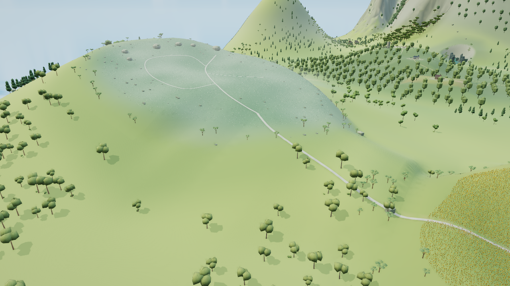
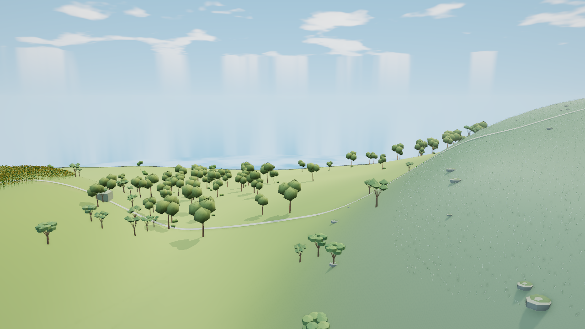
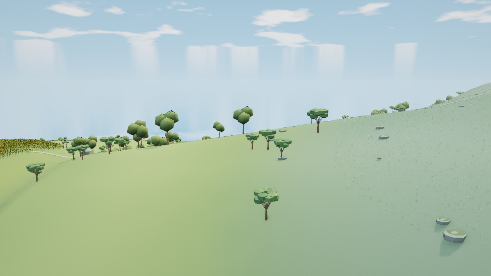

# 花田西缘至无名之丘东坡：坡鞍候选

基于 `6a27bb46d5bba09115501ea9fed402174c27448e`。最终 `2fde1ae2…` 已完成真实原生保护、七组同机位预算与限定宽鞍部图审；基线202与组合208输入的生产生命周期各20/20、CLI0。组合完整Node仍由root执行，远端CI／部署尚未运行。本分支保存Flower独立源码与准确检查协议，集成由root选择文件完成，不合并旧候选祖先。这不代表主空岛或无名之丘精修完成。主线后续纯文档提交 `504808e` 不改变本候选的运行基线；下文旧待测状态保留为当时记录，最终状态见文末。

## 实际基线与本次范围

已看真实 WebGL 基线 `flowerHillSaddle`：上缘到坡脚形成单一光滑陡面；原连接路先落入低鞍再直上山坡；坡脚空旷、树群零散，铃兰覆盖边缘规整。本次先处理前两项的共同坡体，不新增花草或岩块掩盖地形。

基线来自太阳花田已接受产物 `402224fe67018c0fc33c6820f09d04cdea33b80914a79e62ca54de0e627bf8f8`。1280×720、balanced、日间中性、同一相机 `eye[-920,315,1520] → target[-1138,146,1190]`，实际加载 `nameless` 与 `sunflower`。原始 PNG/协议/日志保存在 `/workspace/flower-hill-evidence/baseline`。采集与完整 Node 回归存在 CPU 重叠，只把该图用于构图和确定性提交计数，不比较采集耗时。

范围为 `x[-1280,-928], z[960,1376]`；实际南缘依次经过 `(-1280,1376)、(-1216,1376)、(-1088,1344)、(-1024,1312)、(-928,1280)`。保留 `x[-928,-896]` 的 32 米原地形隔离带及已经接受的太阳花田。采用横跨上肩、原道路中段与弧形坡脚的宽截面，抬起低鞍，保留原路线 XY。

## 实现和保护

`src/flower-hill-entry.js` 登记在已接受的 `sunflower-entry.js` 之后。公共近档仅改授权域内高度和法线，原顶点 XY、索引与颜色保留。六个远档记录从当前生产前驱结果局部重建；四个共享 Solar 地形记录不从原包整体回填。

远档外沿保留原 far 平面，顶点距外缘 32 米内逐步消去原 near/far 高差；实际交裁 near 与旧 far 三角，并在旧高差过零处裁分，避免跨原对角线插值放大 LOD 差。权重及高度差在实际三角内插值，过渡域为含有正权重角点的面；全部角点权重为零的内域采用近档实际面。原近档边界属性不改。每个新 far 属性数组只有一个对应索引，兼容 renderer 的对象身份缓存。

石座 `nameless-windrock` 的 9×10 米清场和相交原 near 三角顶点完整冻结，保留原查询高度及其既有离散误差。所有道路 XY、公共植株 XY/方向/尺度/颜色/身份保持；只按原根部偏移加实际地面高差。冷花毯/道路代理按各顶点接地，冷 `matte` 岩体按原连通体及相接岩身/顶盖分组整体平移，跨范围或碰石座保护域的整块保留。冷代理不声称与原生植物一一对应。

独立 `data.flowerHillEntry.contact` 保存实际新近档三角，`originalContact` 保存同拓扑的旧近档面。局部查询为 `previousHeight + newNear - oldNear`；缺面、域外和石座查询回退已安装的 Solar `Terrain.height`。这样保持既有 analytic/near 偏移，在实际地形变化为零的外沿连续接回原查询，不声称所有原根严格贴 near 面。`data.sunflowerEntry.contact` 保持引用和字节不变。原生 `sunflower` 与 `nameless` 由原建造器重建 Y 接触，路径按 96 米批次中心分属两边；原生双区域保护仍需在画面门后实际验证。

## 当前检查与恢复

硬预算为净增不超过 4 次全通道调用、4000 提交三角、0.6 MiB 唯一新增持久 backing，0 新纹理。新增 source 账目包含 contact 和 far 属性/索引；元数据为普通 JS 数组，不保存临时完整源复制。

作者第一次完整公共前驱预检保留为 `author-prepare-01`：真实末端纵坡 31.62%，过渡带部分 LOD 差放大；探针漏纳入西侧原邻 tile 的缺面报错另列为协议问题。第二次 `author-prepare-02` 已修接缝，432 个实际外缘样本最大差 7.63 微米、石座支撑零变化；末端纵坡仍为 30.685%，继续小幅调节原截面控制点，未放宽 30% 目标。上述原 CLI 1、准确脚本及源快照不覆盖。

`author-prepare-03` 的几何和保护检查通过，但相邻 `lily-main` 实际纵坡为 30.329%，仍记 CLI 1。轻量局部纵坡探针锁定相邻截面后，最终 `author-prepare-04` 重新执行完整公共前驱与 Solar，8 项作者预检通过、CLI 0（36.484 秒；无 native/GPU）。源 SHA 为 `0dff69dc6cbac11fd29b11a34ab1d2f18fda90ea8b758dc4ed5b8ea72e94fc49`。实际新增持久 source 为 **365280 B**（含 contact 118728 B），far 净增 **3775 三角**，0 新记录/纹理；该轮当时尚未测画面提交量。432 个外缝样本最大差 7.63 微米，石座实际近档支撑零变化，3298 个 contact 面与近档误差不超过 `8.53e-14` 米；原 Solar contact 的引用与 SHA 保留。`flower-hill-link` 域内 104 段最大纵坡为 **29.092%**，`lily-main` 48 段为 **28.969%**。这是离散地面查询结果，不是可达性或帧率结论。

同相机 CPU 投影的 33 个实际截面点和 5 个弧形坡脚点均位于画面范围；没有计算遮挡，不能代替真实图。作者报告、脚本、源快照分别保存在 `/workspace/flower-hill-evidence/author-prepare-04.{json,mjs}` 与 `author-prepare-04-source.js`，实际原始 stdout 为同名前缀 `.log`。独立检查由另一代理负责，其结果不能用上述作者预检替代。

下一入口：背向超预算的有限逐对象归因 → 保持已接受画面的定点修复及受影响机位复核 → 补完成本断言 → 两个 native 区域的专门回归、真实交互与卸载重入、完整 Node 回归。公共检查和七组图审已经完成，不重复未改源码的既有实验。该候选仍未合入主线；单一方法两次无可见改善即隔离保存，不以资源统计替代画面收益。

## 首图及定点技术修复

真实 `v1-capture/flowerHillSaddle.png`（HTML `be1c412e…`、203 输入前后一致）显示连接路沿宽鞍连续下降、道路两侧及南坡形成完整承托；主代理和美术代理均允许进入补充视角。右中部与原低地相接的凸肩须用低位与反向图核对，裸地、树冠、花缘仍未精修。首图最后两帧与基线的提交计数一致，不能据此宣称帧率提高。

独立 `independent-public-v1.json` 为 **16/19、CLI 1**，原文件保留：跨 `x=-928` 的道路查询间隔为 31.7535%，其实际 near 面坡度仅 26.984%；这是旧候选的新查询边界行为，也会影响按查询生成的原生路面，不能称纯测试误报。另有两个冷 `matte` 记录使用共享索引，原代码却按连续三顶点分面，导致错误连通与位移，已改按真实索引面及唯一顶点集合整体平移。第三项的四个 0.429–1.677 毫米残差来自跨带三角被按单点距离误归内域，同点新旧 LOD 差没有放大；只校正实际过渡域说明，不扩大网格。

修复源 `87096ff308a83880c2332b79a554ec9edc098bd0f534db52a1fc965934c7114b` 保留首图的截面控制和地形生成，用上述实际地形增量查询解决边界。`author-repair-probe-01` 为有界预测，未执行公共前驱/native/GPU：连接路最大查询纵坡 29.1596%、`lily-main` 29.3513%；两个冷记录的实际 682/568 三角分别完整分到 17/13 个刚性组，共享顶点未分属不同组。4 米网格的 9345 个旧 analytic/near 样本，绝对偏移中位数 0.02389 米、P90 0.19906 米、P99 0.50669 米、最大 0.85442 米；这些是被保留的既有偏移，不是新实现消除的接地误差。

## 修复后的实际结果与阻塞

`independent-public-v2.json` 已对修复源执行完整生产公共前驱及 Solar 组合：**19/19、CLI 0，41.384 秒**，203 输入、源和执行工具前后一致。实测唯一新增 backing 为 **484008 B**，含两份各 118728 B 的 contact，静态净增仍为 **3775 三角**，0 新记录/纹理。1113 个实际外缝探针最大差为 7.63 微米；连接路 105 个间隔的最大实际 near 坡度为 29.0917%，最大查询坡度为 29.1596%；真实索引冷体 26 个移动组、98 个焊接体的刚性/非 Y 属性检查通过。此报告的旧 near/query 偏移采样域与作者 4 米全域网格不同，采样范围 `[-0.621573,+0.511691]` 米保持不变，新增误差不超过 `1.42e-14` 米；不是根部零离地误差的证明。新增 `originalContact` 已计入 source，运行时清退与 Worker 生命周期仍待专门回归。

最终产物 `aa4519cd467d289a508235e3151abd65ba07eb7b575da03d5165d24558165879` 的七组实际图片均已采集并逐对审阅：`coldOverview`、`defaultEntry`、`flowerHillSaddle`、`flowerHillEastLow`、`flowerHillReverse`、`low`、`night`。原图分别在 `/workspace/flower-hill-evidence/{baseline-views,final-views}`，美术结论为 `art-review-870.json`：允许保留宽鞍与既有路线承接的小阶段，侧低位与背向未见新开口或明显悬根；背向白路部分被新肩体遮挡，不能据图宣称整路可见。冷总览只覆盖全岛尺度，单块冷岩接地仍不可辨。裸地、旧冠形与规整花缘保持为未完成项。

七图采集无 JS/上下文错误，仅有 `/favicon.ico` 404；203 输入、HTML、协议和视角规格前后一致。但原成本协议在 `flowerHillReverse` 检查失败，**整次 capture 为 CLI 1，原报告保留**：

| 机位 | 调用净增 | 提交三角净增 | 成本断言状态 |
| --- | ---: | ---: | --- |
| coldOverview | 0 | 3775 | 通过 |
| defaultEntry | 1 | 1404 | 通过 |
| flowerHillSaddle | 0 | 0 | 通过 |
| flowerHillEastLow | 0 | 1158 | 通过 |
| flowerHillReverse | 1 | **8464** | **失败，超过原 4000 三角预算** |
| low / night | — | — | 图片已采、已审；本次逐行成本断言未抵达 |

反向机位实际由 `139 calls / 660107 tris` 变为 `140 calls / 668571 tris`。正在进行有限的双产物实际 draw/对象归因，尚不能把新增量归为远档拓扑或包围膨胀，也不提高预算。截图期间实际加载了原生区域；后续已完成有限 Nameless 成对源诊断，原 **5/9、CLI 1** 见下。双岸专门回归、交互、卸载重入和完整 Node 仍未运行。没有硬件帧率或物理显存测量，不作帧率、CPU 加速或加载提速结论。旧作者失败、原 16/19 独立失败和本次成本 CLI 1 均与新通过项分开保存。

## 背向归属、原生净空及本次定点修复

严格保留 870 的原七视图成本 CLI 1。随后只重现前五个原相机/LOD历史，在 Reverse 记录实际 engine draw：新增 8464 三角准确闭合为两批原树从 far 合法转 near 各 +1158，加一批原铃兰 `flowerlands:nameless:lily:0:-39:35` 的 212 株 × far 29 面 = 6148。树的真实中心距离跨原滞回阈值，不锁 far、不删树。铃兰 cached sphere 与 fresh far sphere完全一致，未将其误归为旧 LOD 球缓存问题。该批真实 near/far 变换三角均不入视锥，含任意 shader 风摆的最宽右面余量仍为 −0.782402 米；6148 是实际球剔除假阳性。原 `reverse-draw-attribution.json`、两次实际追踪及输入/HTML绑定均保留。

有限 `independent-nameless-native.json` 实际执行完整公共前驱与两次 Nameless 构造：原摘要 **5/9、CLI 1**，原始 SHA `363615ad…`、工具 `2a56935c…` 保留。五项原生身份/原型/颜色/非 Y 矩阵、道路/石座与范围外架构、实际 bounds/bytes通过；四项零道路净空断言失败：基线 near188 / far80，870候选 near182 / far80。完整离线对象对归属为 near新增8/消除14/相同174，far新增12/消除12/相同68。新增交对的道路/植株 XZ和原型都未改：既有水平重叠原先低于 −0.05 米，根部与道路三顶点的不同地形 Y 增量使它进入原检查带，不能凭总数减少称净空通过。

本次只修真交叉的 **29株草/铃兰、12原记录**，详列在源码与独立 checker 的固定原 ID+实例索引表。联合实际道路与两档全风相位凸包求最近安全外移；原单一路法线在 `lily:0:-40:34 #242` 的 `lily-main/lily-contour` 分叉处即使1米或2米仍不脱离，两个方法 CLI 1保留。改用实际道路联合占地边界后，离线最大外移仅 **0.253202米**，最终源码硬上限 **0.30米**；两档原零侵入断言与至少3厘米全相位水平分离均通过。目标经 Float32 落点后按真实 `Terrain.height` 重新接地，并保留该根既有 query偏移。只允许白名单 matrix[12,13,14]，其他根 XY、树木、路线、原型、颜色、尺度、朝向、总数全部保持。冷代理未据 native 白名单臆造对应或迁移。

然后仅将上述212株铃兰原批按原32米格的 X=−1232、Z=1136 中线分成固定16米四象限，分别52/59/48/53株。两分X/Z模型仍超4000；四分模型的 Reverse只提交53株的1537面，与两树2316合计 **+3853面**。默认入口预测 **+4 calls**，其余原暖机位不超过+3；还保留1537面的球假阳性，未声称零误提交。实际原型、矩阵和颜色不变，每子批保持原 parent centre/radius/LOD/material/owner并列 parentId/sourceIndices一一映射；共享原近远原型，Three正常计算实例球，不改renderer或手动缩球。每种实际 near/far 子球分别覆盖两种 LOD及完整风摆，16项离线检查通过，最小余量约4.67厘米。29株中仅原212株的 #4/#203被移位，四象限人数与上述预测不变。

这些结果是已存原生快照上的离线诊断，不是当前源的实际 native/GPU验收。`offline-road-repair-proposal-03.json` SHA `0fc1feed…`，CLI0/6.37秒、0 native build/0 GPU，保留01/02的原失败。revision3新源在自身 `buildRegion` wrapper中应用显式白名单和四分；公共 prepare/坡体/contact/query 数值算法未变，原19项执行证据引用保留，不为本次只改 native重复公共整链。原 public checker实现保留，新增 opt-in `checkFlowerHillNativeRepair` 从独立870 checkpoint验证全部原生字段、映射、白名单、两档原零断言、全风摆/缓存球/账目。其候选通过项与原基线失败分列，不能称旧9项协议全通过。

下一入口：冻结 revision3源码与checker → 实际 native候选/双岸保护 → 受影响原机位预算和画面复核 → 真实交互/卸载重入及必要完整回归。当前仍不可发布，不提高 +4calls/+4000面/.6MiB/0新纹理预算，不宣称FPS或CPU提速。

revision3 已冻结为 source `2fde1ae2fa094decaf57facaf07fd895fe0a13fcb962480510f7a76ccc2ad549`、checker `7f22d62fb6c8816560d5a26bb378d1947afcee1a566e4eaa8eae8427ae77f4ac`，project `d9ae63c…`未改。`native-repair-source-freeze.json` 静态证明旧公共 prepare/contact/query 主体及原19项检查/CLI逐字未变。源码共享父原型、不保存完整旧 typed复制，四分实际额外矩阵/颜色 backing为16112 B；与公共484008 B合计保守上界500120 B，仍需实际构造账目和浏览器驻留验证。

冻结后 `native-repair-values.json` 对之前实测870 V8值执行当前 `applyNative` 与独立修复 checker：**10/10、CLI0、5.27秒**；报告 SHA `6a3e6206…`。29株固定名单、两档原零侵入断言、完整风摆3厘米分离、67347株身份/原型/颜色、212索引双射、父bounds/LOD及16项跨LOD缓存球包含、账目/幂等均通过。当前值变换 digest为 `d76dc3a609bafd73ce25e51bdbd93ab1cd7defa11f49d0aac65ad5ca1a519ea3`，不是已接受fixture；基线原5/9及失败仍明确保留。此轮 **0生产hook、0新native构造、0GPU帧**，V8反序列化缓冲身份不用于宣称真实源驻留/显存改善。当前实际新的 native、双岸保护、渲染预算/画面、卸载重入与完整Node仍待运行。

## 最终实际验证与独立审阅入口

2026-10-05 22:40 UTC后补充：上文的待测状态属于各自写入时刻，不覆盖其失败与未测记录。最终source保持`2fde1ae2…`、独立checker保持`7f22d62f…`，本分支project为`d9ae63c…`、顺序Solar→Flower。公共坡体/contact/query主体未改，引用已执行19/19；没有为native定点修复重复公共整链。

三次真实构造依次为Nameless最终、Solar-only Sunflower基线、Flower后的Sunflower。Nameless实际10/10，29株与原零侵入断言均通过；新包digest`d76dc3a6…`。Sunflower基线精确复现已接受`f0e2d187…`，候选`b3904a25…`，原检查6/7、CLI1保留。唯一失败为域外四个既有路角点的法线依赖进入新高度域；后续只允许实际`flower-hill-link` sample45的四点／18个重复顶点，XYZ/RGB及其余域外九属性保持逐位相等，新旧法线各自与原±1米高度采样逐位一致，严格3/3、CLI0。没有重写原6/7，也没有新增泛化边界豁免。

203输入的Flower单区产物`da10025a…`已沿原七机位协议实际执行一次，115.767秒、CLI0；全部203输入、HTML、协议／机位规格保持。这里的新独立checker不是203 release输入，已另按完整SHA绑定。下表均为原预算、原历史下最后稳定帧的实测差值，不能将离线预测写为实测。

| 机位 | 调用净增 | 提交三角净增 | 属性驻留净增 |
| --- | ---: | ---: | ---: |
| coldOverview | 0 | +3775 | +116256B |
| defaultEntry | +4 | +1404 | +60588B |
| flowerHillSaddle | +3 | 0 | 0 |
| flowerHillEastLow | +3 | +1158 | 0 |
| flowerHillReverse | +1 | +3853 | 0 |
| low / night | +3 | 0 | 0 |

root与GPT-6 Astra Max实际逐对审阅全部14 PNG，接受范围限宽鞍、坡脚和既有来路承托。四张未加工原始前后预览与[完整绑定](reviews/flower-hill-final/binding.json)保存于本分支。背向中部路段仍受新肩遮挡，裸地、花缘、旧冠形与林下疏密未完成。

| 原鞍部 | 最终鞍部 |
| --- | --- |
|  |  |

| 原背向 | 最终背向 |
| --- | --- |
|  |  |

生产生命周期在另外的实际整合工作树执行，必须与上述单区203区分。基线为202／`402224fe…`；候选为208／`c5327ca0…`，真实Solar→Muen→Flower，combined checker`49c73c6d…`仅新增登记与前驱保护，原生10项逻辑保持。统一协议`d6089e3b…`，真实鼠标／滚轮、原生Worker、UI清缓存及相同六秒成熟锚点：两侧各20/20、CLI0；46个独占native GPU几何释放，native cache／required／maps清空，source／相机／neighbors／wanted／LOD、六资源字段、程序keys／引用、PNG均精确恢复，静态一秒零额外帧。完整两侧202／208输入与原check状态见[精简生命周期包](reviews/flower-hill-final/lifecycle-pair.json)。

组合成熟锚点实测945→950调用、2969190→2968830提交三角、31988366→32027246属性字节、419→421几何、11纹理及164程序保持，即总计+5调用／−360三角／+38880B。这是同时含Muen与Flower的组合账目；单区+4预算不能写成组合总增≤4。该协议没有逐draw清单，不能断言具体批次归属或将三角减少称优化。CPU与root完整Node可能并行，记录的提交CPU不是输入处理器执行时间，不宣称提速、硬件FPS或物理显存改善。

这个独立审阅分支没有改common `check.mjs`、`build.py`或原生fixture，也未在此checkout运行完整Node；干净CI可重建原生入口及Solar前缀适配由root在208整合树完成。208完整Node终态、对应commit CI／Pages及实际线上产物仍待root核实。恢复入口、全部历史CLI1、准确脚本和目前未测项见[审阅说明](reviews/flower-hill-final/README.md)。
