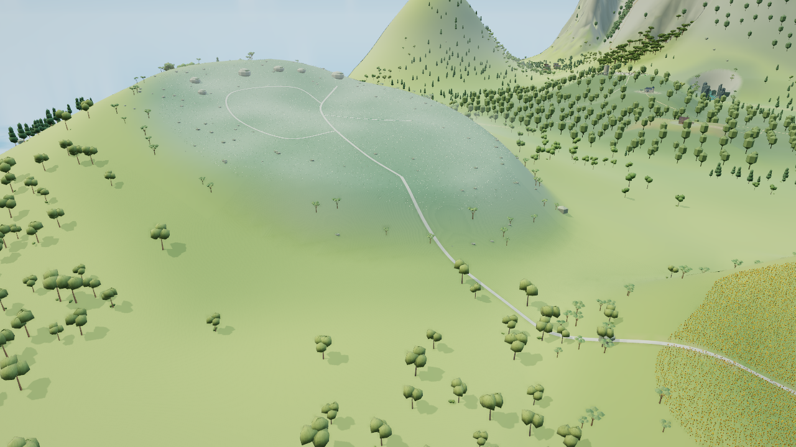
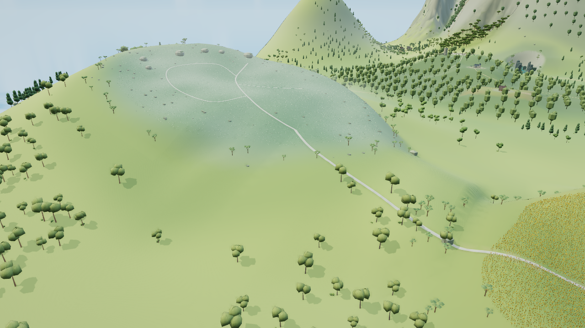
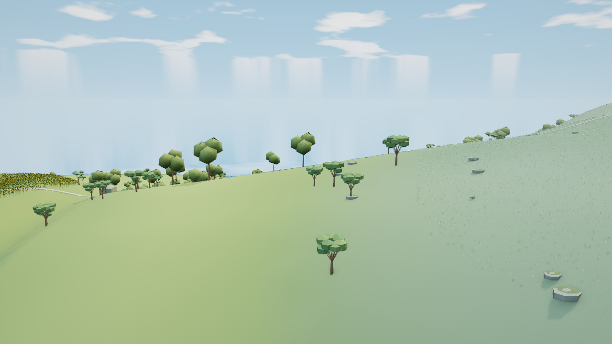

# 无名之丘坡鞍：提交成本未通过的隔离审阅

本分支从文档主线504808e建立，运行前驱仍为已部署6a27bb4／HTML402224fe。准确候选源码87096ff3、project d9ae63c及独立检查器73b1229冻结；203项构建输入对应HTMLaa4519cd。**这是未达到发布门槛的候选，不合入本审阅祖先，也不代表无名之丘完成。**

候选直接形成完整宽鞍和坡脚，保留路线XY、原株身份及XY、风岩石座、已交付太阳花田。公共检查19/19、CLI0；root与Astra实际逐对审阅七组原图，仅接受宽鞍与路面支撑的局部收益。裸地、原树冠／疏密、齐整花缘仍未精修；背向中段道路被新肩遮挡，不能称完整路线从背面可见。更早V1源码0dff69dc的16/19原失败保留于独立审阅3cceacb，本分支不覆盖它。

| 原同机位全景 | 当前宽鞍候选 |
|---|---|
|  |  |

| 原背向视角 | 当前背向候选 |
|---|---|
|  |  |

原七图成本检查保持CLI1：背向稳定帧139→140次调用、660107→668571提交三角，**+8464超过预设+4000**。低档和夜间图已拍并审阅，原始计数已保存，但顺序成本断言在背向失败后未抵达它们。不能把这次采集记作全通过。

随后仅重放既有相机前序，各一次基线／候选实际绘制追踪，均精确复现每帧计数与wanted/LOD历史，没有重拍七图。8464已闭合归属：两组原树各因真实接地后距离变化而正常切到近档，各+1158三角、不增加调用；唯一新增调用是`flowerlands:nameless:lily:0:-39:35`，212株×29个远档三角=6148。其余实际提交批次的调用和三角不变。

该铃兰批始终为远档，缓存球与按当前原型重算的球逐值一致，排除了本批沿用旧LOD包围球的解释。真实视锥右侧平面的球余量从−0.17870米到+0.20676米。随后一次有界Nameless原生成对诊断确认：全部212株近／远档实际三角都在视锥外，完整风动相位包络也不可能进入；右侧平面的最近余量仍为−0.7824米。这6148三角属于保守球误入，不能据此任意缩球、固定远档、改相机或删花。

原生诊断用91.684秒、两次实际Nameless构建，**5/9、CLI1**。原记录、原型、颜色、全部非Y矩阵分量、原路XY、石座和旧根部相对近档面的偏差均保持；但四项原样零道路侵入断言均失败，不能称原生保护全通过。基线near188／far80个相交三角对，候选near182／far80；严格按植物、实例、原型三角及道路三角归属，near新增8／消除14／相同174，far新增12／消除12／相同68。候选涉及29株近档、17株远档，全部根与真实交域都在施工范围内。总数减少并不代表没有新交叉；4株参与新增对，仍待局部净空修复。准确[原失败](flower-hill-native-failure.json)保持原CLI1和堆栈。

对既存数组离线验证固定空间分批，没有重建、GPU或产品源码修改。X或Z中线两分分别预测背向+5564／+5245三角，仍失败；四个16米象限为59／52／48／53株，预测仅53株子球入视锥，连同两组树的2316三角，总增3853、默认入口最多增4调用，七机位预测均在原预算内。每个真实Three子球均能包含两档全部实际顶点和完整风动相位，含换LOD后沿用另一档球的16项组合，最小余量约4.67厘米。**这是待实施预测，尚非实际提交量或发布通过；仍保留1537三角的保守误入。** 路边修复也可能改变球，最终须重新核验。

唯一新增持久源backing484008B，含contact和originalContact各118728B；静态far地形+3775三角，0新绘制记录／贴图。源缓冲与实际提交量分别计数，未把前者通过当作后者通过。所有浏览器证据使用SwiftShader，不代表实体FPS或显存改善。

准确源绑定、原CLI、全部三帧计数、图审和实际draw归属见[成本证据](flower-hill-cost-evidence.json)；后续原生成对、完整相交对清单和离线分批见[有界诊断](flower-hill-native-cost-diagnosis.json)与[球兼容证据](flower-hill-split-sphere-review.json)。普通说明见[候选说明](flower-hill-candidate.md)。Sunflower成对原生保护、道路净空修复、真实交互／卸载重入、完整Node和此候选CI／部署均未完成；不要复用前驱太阳花田的通过冒充本候选验收。

恢复先用仓库正常构建得到203项／HTMLaa4519cd，再检查已保存的原失败。原七图协议为[准确采集脚本](../tools/capture-flower-hill-cost-review.py)与[机位规格](../tools/flower-hill-cost-review-views.json)，三帧显式绘制及GPU finish仅用于构图和计数。实际追踪的[原脚本](../tools/trace-flower-hill-cost-review.py)仍保留执行时的绝对父协议路径及SHA；若换环境复现，先把准确采集脚本放到它声明的`/workspace/flower-hill-evidence/capture-views.py`。路径适配后的新协议必须另记散列，不冒称原执行。

新增保存的[原生诊断](../tools/diagnose-flower-hill-native-review.mjs)、[离线分批](../tools/diagnose-flower-hill-split-review.mjs)及[LOD球兼容](../tools/diagnose-flower-hill-spheres-review.mjs)均为执行时准确内容，保留历史绝对路径／源码保护。恢复时在隔离环境还原这些路径，或另记适配协议；大型V8和逐顶点数组不入库，原生脚本可重新生成，其准确原散列在失败报告内。不能把脚本准备或本审阅文档校验计作新原生／GPU通过。
