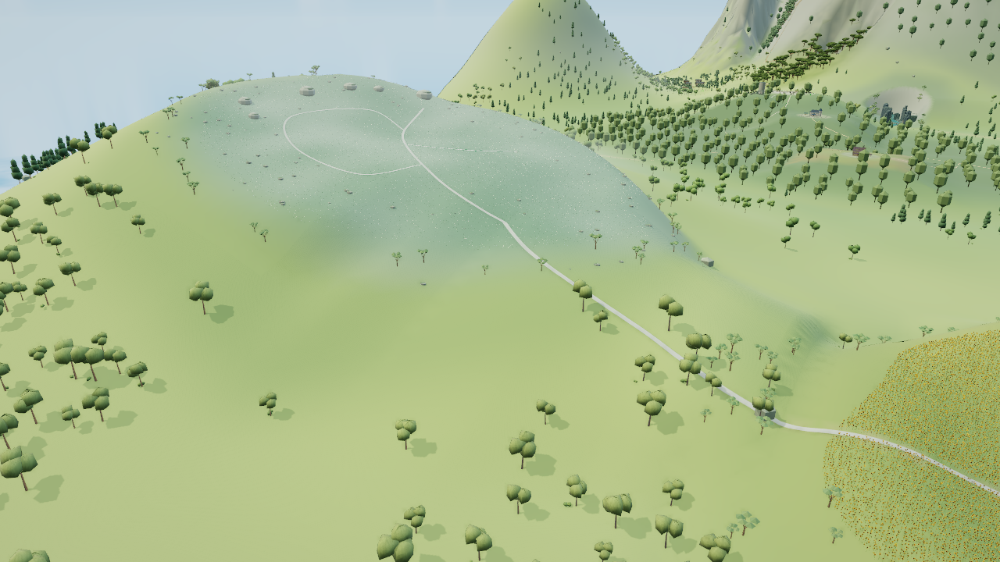

# 无名之丘宽鞍 V1：实图有收益，技术检查未通过

这是从已验收主线 `6a27bb46d5bba09115501ea9fed402174c27448e` 建立的独立审阅分支，保存原候选与原失败，不能整条合入 main。修复后的正式候选在另一工作树继续，本分支不冒充其验证结果。

V1 源码 `0dff69dc`、工程登记 `d9ae63c0`、203 项构建输入，HTML SHA `be1c412e86c1e0ee09f6dc3555bbbd607976eb1181e9b0ca24239d35d33cdc01`。原候选说明逐字节保留于 [设计快照](flower-hill-candidate.md)，原检查、取图绑定与归因见 [证据](flower-hill-v1-evidence.json)。

root 与 GPT-6 Astra Max 实际看过下列同机位原图：道路较原来连续陡升有清楚改善，承托形成宽鞍，原路线与树木身份保持。右侧凸肩需反向和低位复核；裸地、树冠及规则花缘尚未精修，不能据此称整丘完成。

两图同为 Chromium 151／SwiftShader，1280×720、DPR1、FOV49、晴天12.5、balanced、AO开，动态／人物／标签／Bloom／反射关。双岸按固定顺序加载。候选取图44.296秒、CLI0，源与成品前后不变；没有脚本或上下文错误，仅favicon404。最后两帧均为945调用、2969190提交三角、31988366属性字节、415几何、11纹理，与原版相同；不代表硬件FPS或加载提速。

GPT-6.1 Sol Max 的原独立公共检查工具 `91f4f5ee` 实际16/19、CLI1，保留全部原断言和结果：

- 四个远档探针被错误归为完全离开过渡带，实际所属三角仍跨带；原近远误差不增加的检查成立。这是检查器内区分类问题，不为此增加地形碎片。
- 连接路在x=-928处从原高度查询切到新实际接地查询，跨界路段实测31.7535%，超过预定30%。实际近面内部最大29.0917%不能抵消由查询生成的道路边界问题。
- 冷总览岩体具有真实共享索引，候选按无索引顶点三连组处理，存在刚性体归属错误。后续必须按真实索引和共享顶点修复。

新增唯一源缓冲365280B，含contact118728B；远档静态净增3775三角，0新记录／贴图。这些成本和石座／太阳花田保护通过项不代替美术或完整回归。

本分支未运行原生双岸几何对照、最终七视图、生产交互与卸载重入、完整Node回归、CI或发布。归档时只复建精确V1成品并验证散列，没有重跑已完成的昂贵检查。复现单图可使用保留的准确 [取图脚本](../tools/capture-flower-hill-v1-review.py)；需显式指定源目录、构建目录、输出目录、预期HTML散列与标签。
