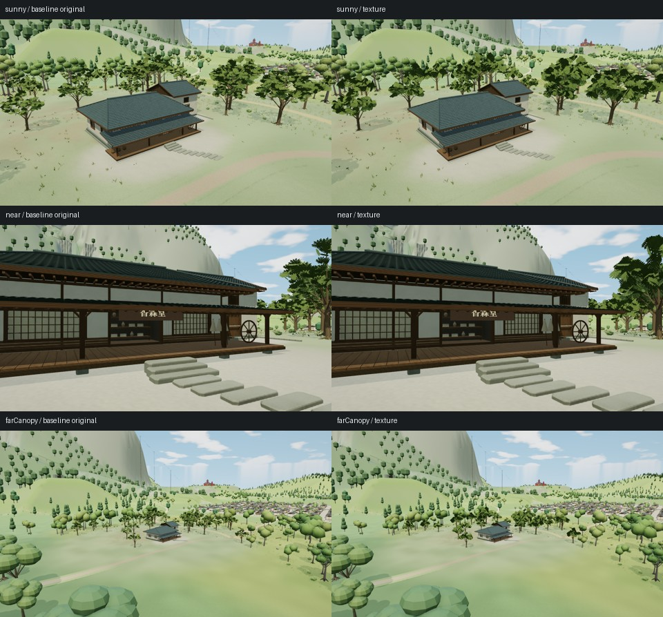
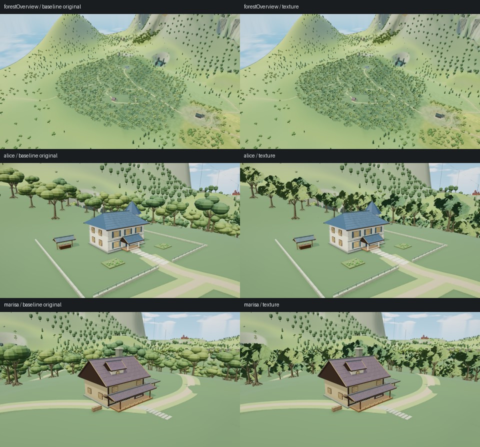

# 重复树木贴图对照

基线为 `1f09b002b29ef56e5262633152fe527e086eb0c2`。判断原则是保留已有画面质量，并核实整帧成本；减少叶片三角形本身不等于提高帧率。

## 香霖堂候选v1.2：保留原方案

原香霖堂已经使用实例化、近远档和透明裁切叶片。本次候选为32棵原树增加叶簇颜色／法线图集，并把远档叶片三角形从6,528降到3,264，近档13,056不变。树点位和LOD阈值保持。

三组固定机位各取3帧，组内像素稳定；相机、光照、非目标可见记录及目标LOD一致。候选树冠明显更密、更深，改变了原有疏朗层次，因此不采用。对照图左侧为原方案、右侧为候选：

| 机位 | 原方案整帧提交三角形 | 候选 | 变化 |
|---|---:|---:|---:|
| 正面 | 1,180,714 | 1,176,634 | -0.346% |
| 近景 | 1,034,185 | 1,034,185 | 0 |
| 远树冠 | 1,758,343 | 1,751,815 | -0.371% |

统计包含强制刷新的阴影和两次后期绘制，属于静态画面核对。候选增加两张512×512图集，完整mip的CPU数组合计2,796,200字节；这不是实体显存测量。Chromium151／WebGL2／SwiftShader的生产调度试跑及非阻塞回收重试都未返回通过断言的完整计时结果：重试取得8帧中的7个结果，末尾查询在6秒窗口内没有回收，未发生disjoint或GL错误。随后64×64最小场景的3个查询均正常返回，确认扩展本身可用；仍没有可接受的本次A/B GPU耗时或FPS结论。

条件为1280×720、DPR1、balanced、晴天、时钟12.5、动态关闭、AO开启、微光和反射关闭。精简数据、源码与成品散列见[对照记录](../tools/foliage-texture-kourindou-result.json)。未用强制取图帧的CPU耗时冒充性能测试。

## 魔法森林候选v1：保留原方案

森林原树冠是实体椭球簇，755棵树的近／远档叶冠分别为每棵2,400／280三角形。独立候选改为具有体积的叶簇卡片，预算为720／160；保留树干、主要枝条、树矩阵、实例颜色和原LOD距离。

在相同条件下完成总览、爱丽丝宅、雾雨邸3组各3帧实景。相机、光照、非目标可见记录与目标LOD一致，组内像素稳定，没有脚本／着色器错误或上下文事件。整帧提交几何减少，但总览树冠稀疏、破碎，近景出现深浅叶片平面交替，冠层体积下降，因此不采用，也不继续该版本的长时间性能实验。

| 机位 | 原方案整帧提交三角形 | 候选 | 变化 |
|---|---:|---:|---:|
| 森林总览 | 1,302,448 | 1,121,248 | -13.912% |
| 爱丽丝宅 | 834,217 | 594,697 | -28.712% |
| 雾雨邸 | 1,305,024 | 1,046,544 | -19.807% |

整帧绘制调用数为总览1,242→1,242、爱丽丝347→347、雾雨邸540→542；每组增加两张纹理和两个程序。精简数据与散列见[森林对照记录](../tools/foliage-texture-forest-result.json)。这些是静态强制绘制下的提交数量，没有实体GPU帧率结论。候选在画面阶段即被拒绝，未继续森林性能、夜景或浏览器生命周期实验。两个候选都未登记到生产构建；此结论只针对本轮实现，不代表贴图、叶片卡或远景替身普遍无效。
