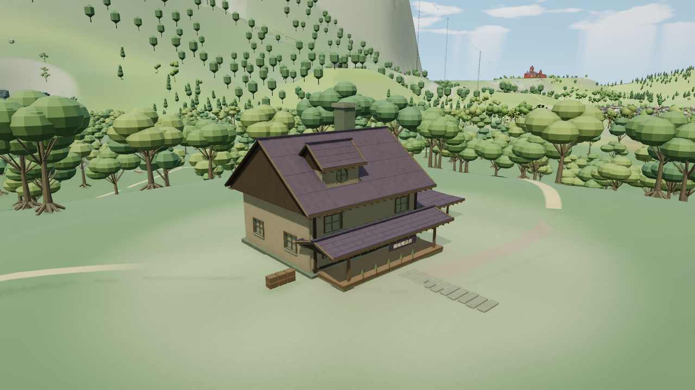
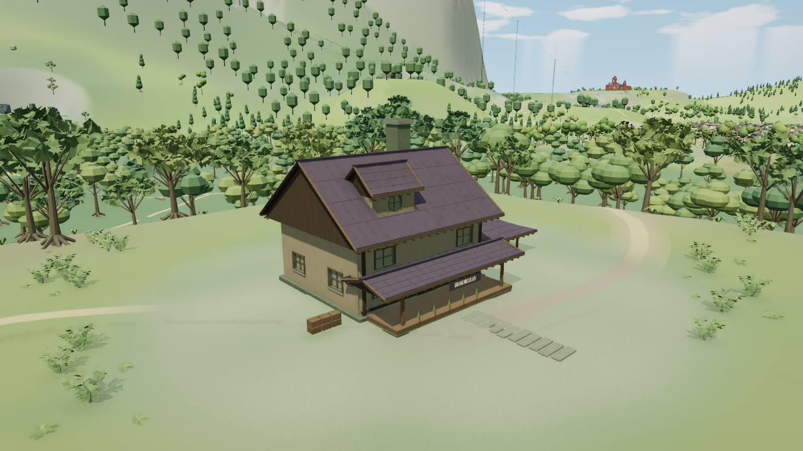
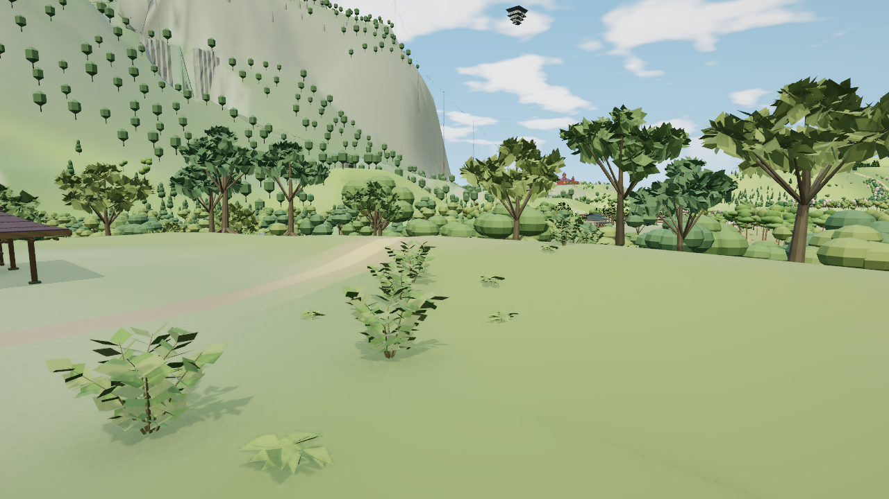

# 雾雨邸林缘整景样板

本页记录`741554f`的47棵样板；后续原生755棵冠层推广见[独立交接](forest-crown-rollout-handoff.md)，不改变本页历史验收范围。

基于已验收的森林入口提交 `ec9fdada`。本样板针对用户指出的「房屋改了、整体场景与树木却缺少变化」，保留住宅和原路线，同时改善原树冠、林下层次与弯道接地。v6正常档、低档、近景、屋后及香霖堂实图、40组完整静态回归已通过。缓存往返的计数差异已有完整对象级归因，本样板按有限范围验收；原诊断的严格计数失败与CLI1仍保留。

## 范围与同机位标准

范围为 x[-1120,-896)、z[0,224)，四个原生112米树格 `-10:0`、`-10:1`、`-9:0`、`-9:1`。47棵原树保留完整实例矩阵、RGB、身份、原木干前缀、包围范围和LOD距离；其余708棵原生树及304个森林冷代理保持。冷代理与原生树是不同精度表示，不能相加为独立树数；这些代理在两处基线机位均不可见。

| 方面 | 这处样板的变化 | 尚未完成 |
|---|---|---|
| 整体构图 | 沿可见左右林缘组织疏密植被组，保留开阔院心和通路 | 森林整区布局、远坡与全岛构图 |
| 地形与衔接 | 四条地形记录只改局部RGB；弯道局部裁交补面匹配实际近远地形 | 山体和坡面高度重塑、其他连接 |
| 树木形态 | 47棵原树的枝端叶簇、侧展和有厚度远冠 | 其余原生冠层及其他地区 |
| 植被层次 | 本轮新增114处候选植被，含低蕨和成组灌木；左右23点组织成林缘过渡 | 整片森林的林下分布和群落密度 |

原生 `marisa` 机位 eye `[-1035,91,183]`、target `[-997,76,140]`、FOV49。1280×720、DPR1、balanced、晴天12.5、AO开，动态、人物、标签、微光和反射关闭。两版都先经过相同Alice暖场，再到雾雨邸取三帧。

验收同时看树冠、林缘至路边的低中层过渡、住宅和通路净空；再检查低档、近处枝叶和接地、屋后、相邻道路与原生卸载重入。代码检查和投影入镜不代替实景审阅。

原版：

v6正常档，同机位与设置：

近景接地与层次检查（不同于上面的前后对照机位）：

## 实现与候选取舍

近树沿用原木干，增加枝端支撑并替换叶簇，三种原型仍共享数组；每树近档总2724三角保持，远档406降为402。没有增加原树实例、贴图、灯或材质。

林下以四条批次匹配实际地形精度，源预算近档9622／远档1917三角、1,246,212字节。20株中灌木有六条连续曲枝和120片折叶，近档每株324三角；远档为有连续侧壁的厚体，每株50三角。15株新式蕨类使用62／19三角，另79处初稿树脚／路边候选仍为28／8三角。这里的79处是本轮新增候选，并非原仓库已有植被。原混合蕨类、菌类洼地、古木和倒木全部保留。

弯道修复保留两条原道路批次的完整顶点与范围，只从索引移走本地被替代面；新增四条近远补面沿原道路XZ裁交实际地形。只有补面跟随对应地形精度，原批次按自身范围可见，避免在香霖堂方向错误裁掉范围外道路。没有逐帧采样地形或改写通用渲染器。

v1的冠层缩小、v2.1的平铺大叶、v3/v4的散点细梗、v5的画外植被带均未获整景接受。v2.1另暴露公共hook换数组后补面被推回旧数组的问题，已用生产调用方式复现并修正；失败截图不作为道路修复证据。v5投影核对发现西侧新6点全部出屏、东侧5点仅1点入屏；v6据实际可见树脚重新分配布局，14个新连接点入镜，并补足灌木体量。原近端12点参数、79处初稿前缀和11株蕨类几何保留。正常档实际对照显示左右群落可读、院心与路线清楚；这仍是松散的局部林缘，不是整区森林完成记录。

## 已测成本与验收状态

正常档实际CLI退出0、清理无异常，三张PNG逐字节相同；2517条源记录核对通过，其中2479条非目标记录保持。没有脚本、着色器或上下文错误，一条未归因资源404单独保留。

| 同机位静态提交统计 | 原版 | v6正常档 |
|---|---:|---:|
| 绘制调用，含后期 | 556 | 563 |
| 提交三角形，含后期 | 1,286,303 | 1,308,823 |
| 稳定后的几何属性字节 | 42,863,422 | 44,851,900 |

调用增加7次、提交三角增加约1.75%、属性增加约4.64%。候选首帧为50,167,400字节，随后已有宽限缓存释放5,315,500字节，后两帧稳定在表中数值；不能把首帧缓存混作稳定成本。纹理13、程序156保持。这是Chromium151／SwiftShader的固定取图统计，没有实体设备FPS、物理显存或整体提速结论。

有限CPU已检查原源保护、实际地形接地、枝叶连接、原树根与七条路线、住宅和院心净空。正常档190项输入的运行时HTML SHA为 `cf78491451d35ce279ce9f0bd5d752e83f57451a5d2bc120ab076fabafea033d`；该运行快照使用基线构建工具，不含正在集成的两个新检查器，不能称为最终完整回归通过。

低档、唯一近景接地机位和原生屋后三组各三帧已完成并实际看图接受。低档冠层有厚度，但细小林下叶片仍较碎；近景能辨认连接的枝叶和根基，背侧保持住宅与通路净空。第一次补充会话因取图脚本忘记恢复隐藏界面而退出1；修正后第二次在香霖堂因原生相机回算的7.1e-15坐标舍入触发逐值相等断言退出1。两个失败保留，已通过的9张干净截图单独审阅；续集仅允许相机坐标1e-10绝对误差，FOV、源数据、LOD、资源及返回PNG继续严格检查。

香霖堂续集已确认原道路范围外面149仍可见，四条局部补面在该机位正常剔除。一次原生清缓存的363条森林记录及旧数组引用清理通过，2154条公共源与身份保持，重入后2517条源及三张PNG完全恢复；但最终资源比较因引擎几何302→311、程序187→186退出1。属性44,851,900字节、310条几何引用与13纹理保持；仅凭这些相同数值当时不能归因，故另外只运行了一次带对象归属的有限诊断。

固定森林期望已经显式审阅，192项最终构建与实图HTML逐字节相同，Node22完整40组检查通过，实际退出0，前后输入及release散列不变。这次通过项没有再跑全套。最终干净发布树只重建并核对相同输入与成品散列。

## 最后一次缓存诊断与收口

V6.3从12:56:45到13:01:30 UTC，实际耗时284.95秒、CLI1、清理0。原有「同暖场终点五项计数必须相等」断言保持失败，原报告SHA为 `8463780c99d412f19a39096c0c30b1815db99bfa4a5d501689c24035ef661dc1`。随后只读取已保存的四次对象库存，没有新截图、GPU运行或生产代码修改。

九个计数增量的几何ID与UUID前后完全相同，均原已由CPU持有：三块高地公共路、两块圣域公共路、一块公共地形与三块山地总览建筑。它们在清缓存前的Diorama机位首次提交而登记，回程继续合法持有；四个库存的已解释数分别等于引擎302／972／893／311，无未知几何或仅登记的孤立对象。

少掉的程序id162只属于旧香霖堂／雾雨魔法店两块牌匾材质，随两材质释放；当前所用程序159按完全相同缓存键重建为191、引用数仍2。55个旧原生GPU几何与两块牌匾材质在卸载后及返回后均已真正释放。另四个未枚举材质持有者的深度程序，其缓存键、ID与引用数前后完全不变，不参与差异。

因此本次差异来自登记历史和已释放牌匾的旧程序变体，原总数比较的暖场前提不成立；两名独立审阅者与有限已存数据核验共同接受这次恢复。没有放宽原断言、把CLI1改为0或外推为长期无泄漏。一条未归因资源404继续保留，脚本／GL／上下文错误为零。紧凑对象清单、保留的失败和验收依据见[审阅记录](../tools/forest-canopy-review.json)。

## 阶段耗时与下一项可见交付

本样板基线约08:40 UTC完成，v6整景约12:01通过，试稿阶段约3小时21分；完整40组回归12:23:31–12:37:47，14分16秒；补充视角及缓存诊断阶段约一小时，与回归部分重叠，不能相加为串行耗时。过多局部试稿和补充验证拖慢了整体推进，后续按用户要求限制迭代。

当前资源归属阻塞已经解除。755棵原生树冠推广与既有人里河岸—石桥—街院植被分开推进；先核对轻量投影和路线／建筑净空，再看一张同机位整景，画面通过才跑长回归，源码未改的通过项不重复。每个小样连续两次无改善就保存并重新审视方法或换独立任务。爱丽丝林下方案保留待实施；不新增其他大地区，不把本样板等同于全岛美术完成。
