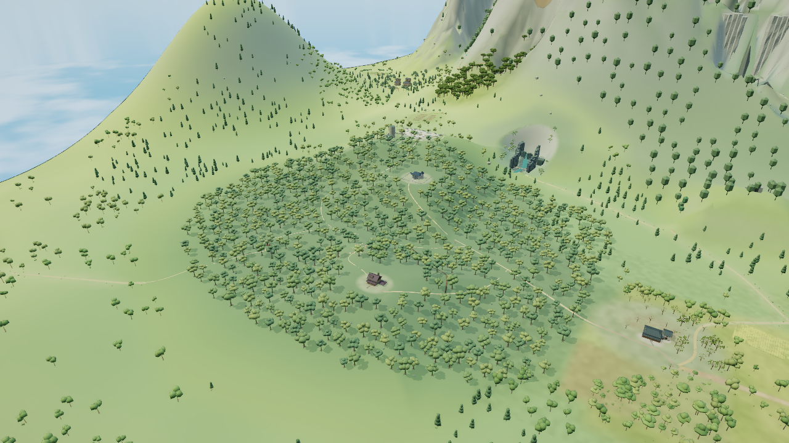

# 原生森林755棵冠层推广

基于已验收的`741554f`雾雨邸样板，将同一组三种冠形从47棵推广到全部755棵原生树。全部位置、矩阵、颜色、身份、木干前缀、LOD与包围范围保持；不增加原树实例。原47棵几何、53条非树记录及4条已验收林下记录逐字节保持，道路、公共接地和渲染器没有修改。

## 画面范围

原生`forestOverview`机位为eye `[-604,580,714]`、target `[-1080,74,-56]`、FOV49，1280×720、DPR1、balanced、晴天12.5，AO开，动态／人物／标签／微光／反射关。先做轻量投影，再取两版各一张全景；首稿即通过有限冠形门槛，没有继续局部试稿。可辨认更有厚度的冠簇与轮廓层次，原林间道路、住宅和空地保留。

原版：

纯冠层推广：

两图来自`ec9fdada`与同基线纯冠形候选，不是最终组合成品的逐像素截图。最终集成基于`741554f`，树冠输出与纯候选相同，并保留另行验收的雾雨邸林下／道路。一次最终森林包核验确认原47棵和全部非树数组不变；没有为组合版本重复旧机位或缓存实验。

155个叶批均为远档，批中合计755个实例；这不是逐像素遮挡清点。近冠沿用已通过雾雨邸近景和低档审阅的原型。304个冷总览代理是独立表示，此机位不可见，源码保持，不能称已完成其美术升级。整体林分分布、外围山坡、地色硬边与全区林下层次仍未改变。

## 实现与成本

主编排只调用一次纯冠形入口，全部755树共享12份近远几何视图和一个木干缓存。原24条样板记录的标记仍为1，完整森林包使用新修订号2，避免重复处理旧47棵。树检查扩展至310条记录／155对，原有非目标保护继续严格执行。

每树近档仍2724三角，远档406→402；全体展开近档2,056,620保持，远档306,530→303,510。以下为两张纯冠形对照的实际提交统计：

| 固定全景，含后期 | 原版 | 推广候选 |
|---|---:|---:|
| 绘制调用 | 1,263 | 1,263 |
| 提交三角形 | 1,284,830 | 1,278,790 |
| 驻留几何属性字节 | 32,256,982 | 32,255,686 |
| 纹理 | 13 | 13 |

提交三角减少6,040，属性少1,296字节；这是Chromium151／SwiftShader的软件图形统计，不代表实体设备FPS、物理显存或最终组合成品的帧时收益。

## 验证与失败边界

两版相机、设置、可见批与LOD、光照和场景一致；实际目标几何与六个木干前缀核对通过。取图脚本随后错误读取缓存条目的元数据路径，实际退出1，候选完整运行时源扫描未执行。原失败保留，没有重开GPU；脚本／GL／上下文错误为零，两会话各一条未归因console404，浏览器和服务器正常关闭。不能把图片成功等同于该脚本全通过。

集成后另做一次有界CPU源审阅：只构建一个森林包，复用其入冠层前的相同源包重放`741554f`旧47树实现，精确复现旧森林摘要`795ff759…`。原47树、非树／林下记录保持；全部实例、原木前缀、预算与7,080,390个实际变换顶点通过，原球界最小余量6.822米。审阅约28.10秒，未构造全图或其他地区。仅显式更新固定期望的forest字段为`3140bd28…`，另外12地区及旧审阅历史保持。

193项最终构建及Node22完整40组回归通过，实际退出0，用时13分40.7秒；全部源码输入及成品散列保持。独立代码审阅确认主线程／Worker共用顺序、单一入口／缓存和310条严格身份保护，无阻塞项。最终状态与完整散列见[审阅记录](../tools/forest-crown-rollout-review.json)。

## 后续与迭代限制

人里街院首图因冠层变薄、植被仍呈散点拒收，保存在独立候选；只再尝试一次有实体体量的冠簇／灌木方法，不随本次推广提交。若第二次仍无明显改善，保存候选并换方法或独立任务，不降低标准。后续先轻量投影／净空及一张同机位全景，画面通过才长回归；源码未改的通过项不重复。
