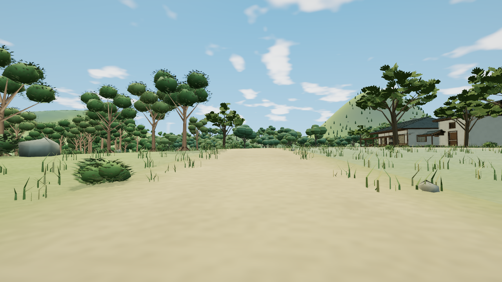
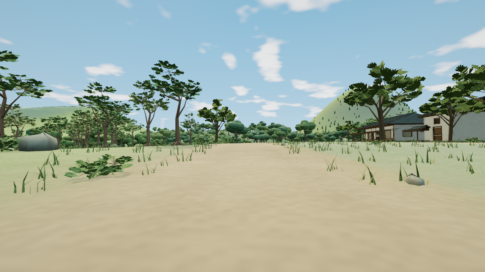

# 森林入口整景样板交接

本轮基于 `bdf1f93`，保留已验收的兽道溪桥—夜雀屋样板。最终v4的balanced／low同机位画面、完整卸载重入及Node22完整回归39组均已通过，按用户既有授权直接交付主线。这是局部入口样板，整片森林与全岛重绘仍未完成。

## 目标与实际边界

用户指出先前房屋变化明显、整体场景和树木变化不足。本样板回到香霖堂来路左侧公共林缘，固定原生 `forestApproach` 机位，同时观察店面、道路、前景灌木和近中景冠层。

| 方面 | 本样板范围 | 仍未完成 |
|---|---|---|
| 场景构图 | 保留既有店面、路线、种植点位；用枝冠形态与冠下层次改善这处入口的阅读 | 全岛与森林整区布局、林带疏密重排 |
| 地形与衔接 | 局部路心、路肩、草地及林缘叶土颜色连续过渡；几何高度保持 | 山体轮廓、坡面受光折线、其他区域连接 |
| 树木形态 | 三个96米公共单元内42棵树的共享原型 | 原生森林755树、总览304实例及区外公共树，不能将这两组计数相加为独立树数 |
| 植被层次 | 同单元49株灌木与1165簇草的原型，保留全部实例矩阵与颜色 | 林下种植分布与整片群落层次 |

树冠样板必须改变原球团外观，叶簇有体量、枝条能够承托；灌木有接地和充实度，不能成为零散叶片。道路保持通畅，右侧已认可香霖堂画面受保护。只有同机位实图成立后才进入低档与重入检查，再进行完整构建检查。

## 方案与保护

植物仍使用同一不透明材质及原近远档距离，不增加树、草、灯、贴图、材质或绘制批次。目标为公共单元 `-6:0`、`-6:1`、`-7:1` 的9个阔叶批、3个灌木批与3个草批。原身份、序号、实例矩阵、RGB与包围范围均保留。实际叶形为五点三角面，叶根沿各自枝长排列，主干／主叉、叶簇和细枝连接；三种阔叶冠具有不同侧展方向。

地表范围为 x[-672,-448)、z[0,192)，边缘20米淡出，使用真实 `route-forest` 路线。只修改五条既有地形／道路记录的RGB；位置、法线、索引、材质、路线和香霖堂核心RGB保持。该处理不能称为地形重塑。

代码分为私有原型、局部地色和一次性总览集成。没有逐帧加工或共享渲染器重写；完整性检查复用调用方已有公共数据，不额外构造世界。新增原型仍会增加常驻资源，不能将目标记录的减量当作整场内存下降。

## 原机位与候选历史

原机位 eye `[-474,44.86402887881689,49]`、target `[-522,46.460583593522614,55]`、FOV64，1280×720、DPR1、balanced、晴天12.5、AO开，动态、标签、人物、微光、反射关闭。原场景HTML SHA为 `a2b85c427607f0d74088c796a8881ea3892bb619e4eba48091488e9c0bcb2a5d`。

v1通过有限技术核验，但实图呈光滑云团冠与胶块灌木，拒收。v2移除近档大壳、使用独立叶形，同机位和源数据核验通过，但灌木过稀、树顶叶簇承托不清，亦拒收；源码还发现灌木侧叶根超出自身短枝端点。两版源快照、失败与重试记录全部保留。它们都未进入主线，未进入完整回归。

v3修复枝叶接合和充实度，正常档方向获得接受，但low叶簇聚合呈大菱形伞盖，继续拒收远档。v4只将远树合为三个带连续侧壁的体量、灌木合为两个厚体，三角预算仍为每树90、每灌48；所有五个近档数组和远草与v3逐字节一致。主审与独立看图确认正常档灌木恢复成片体量，树顶细枝连接可读，低档薄伞片消除，店面与来路保持清楚。低档仍是明显简化的粗体，没有近档叶片细节；远处原生圆冠和大范围林下尚未处理。

原版：

最终样板v4，同一原生机位及设置：

## 验证与成本

v4干净构建36,180,358字节、185项输入，HTML SHA为 `d0a39547bbbdc5308362eba9fbefa59707d861776eeac97dee2ec603119559df`。balanced真实浏览器三帧逐字节稳定，20条目标只发生允许的改动，其余2,805条记录的完整源摘要保持；实际GPU属性来自当前原型，实例、材质、LOD、灯光与投影资格通过。CLI退出0、清理成功，没有脚本、着色器或上下文错误；一条未归因资源404单独保留。

| 同机位静态提交统计 | 原版 | 最终样板 |
|---|---:|---:|
| 全帧绘制调用（含后期） | 670 | 670 |
| 全帧提交三角形 | 1,536,987 | 1,525,659 |
| 驻留几何属性字节 | 22,873,390 | 24,104,914 |

三角形约减少0.74%，属性字节增加约5.38%；几何数277→283，纹理11、程序154保持。这轮主要交付可见的入口树形与冠下层次改善，没有整体提速或实体设备FPS结论。旧共享原型仍被区外使用，新私有数组总计1,926,540字节；源数组、驻留属性和物理显存不是同一统计。

有限CPU检查已验证原数组保护、逐实例原包围球、局部RGB边界、共享近远样本、重复应用和七类失败回退。最终v4完整Node22的39组检查通过，退出0；测试前后185项输入与构建产物保持。首轮测试准备遗漏香霖堂等前序公共处理而退出1，修正真实调用顺序后1,624条公共记录专项通过；没有放宽产品身份或预算检查。针对v3旧远档的中间重跑在12组通过时主动停止，不记作完整通过。

最终v4的low源核对、实际画面和一次原生清缓存重入通过，CLI退出0且所有浏览器正常关闭。675条详情及1,520个旧typed view释放，旧几何／索引／记录／对象／视图／标志引用归零，2,150条公共记录身份保持。返回后全部2,825条源记录、元数据与数组SHA精确恢复，PNG逐字节等于已接受的balanced首图。五项资源前后同为283几何、11纹理、156程序、24,104,914属性字节及281几何条目；回程已预热两种质量档位的程序，与独立冷机位154程序分开统计。森林与村落Worker均实际捕获，生产日志也确认两次重新构建。

v3的辅助Worker记录器曾漏记村落消息并在完整返回源采集前退出1，该旧次不追认通过。修正后先采返回源，辅助事件与生产日志分开判断，核心源／引用／资源断言保留。最终v4两种证据都完整通过。每个会话未归因的资源404单独保留；软件GPU的暖场缓存与截图统计不用于推算实体FPS或显存。精简绑定及最终结果见[审阅记录](../tools/forest-entrance-review.json)。

## 后续

入口样板合格后，继续同一既有森林的原生冠层、林下分布和道路边缘，再处理人里街巷及院落的植被层次。其他既有大区仍按主空岛清单推进，不新增大区。两套早期贴图候选未通过画质对照，只代表那些实现不采用，不能替代上述整景任务。
