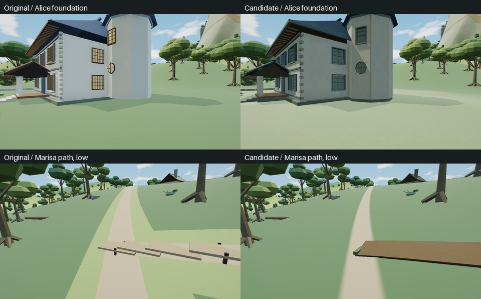

# 魔法森林住宅、木栈道与路肩精修

2026-10-03（UTC），基于 `1f09b002b29ef56e5262633152fe527e086eb0c2`。本轮属于用户授权的主空岛逐区精修，不新增地区、地点、人物或室内空间。两种树冠贴图候选因画质损失未采用，实验和原版对照见[贴图评价](foliage-texture-evaluation.md)。原森林755棵树与总览304个实例保留。

图为同机位原版与最终候选的真实WebGL截图，缩小拼版。上排为爱丽丝塔脚，下排为雾雨来路的low画质；不是概念图。

## 实现范围

爱丽丝宅保留蓝顶洋馆与八角塔，雾雨邸保留陡屋顶、烟囱与作业区；原位置、占地、地点身份与P补完性质不变。替换旧住宅近景10条记录、总览8条代理，增加真实门窗凹口、厚檐、柱脚及背面承托。爱丽丝塔窗放在实际塔面，雾雨邸圆窗和局部屋面留出空间，避免窗框与屋顶穿插。没有完整室内。

结构按相同材质及木纹方向合批，近景与总览各24条记录（爱丽丝11、雾雨邸13），其中7条小物件保持独立距离规则。相对未合批候选的43条记录，129个部件数组的865,269个Float32值逐字节一致；部件范围仅存数字偏移，不保留旧数组。结构共用整宅包围球和LOD历史，继续使用原165米阈值及滞回；因此不保证与各部件分别剔除时的可见三角数完全一致。

木栈道从会随森林详情卸载的旧understorey前缀中精确移出，改为永久公共记录，其余林下几何不变。栈道按实际地形块裁切，近档6条／928三角、远档5条／320三角，通过所在真实地形记录选择精度。首稿曾使用独立LOD而穿坡或悬空，已废弃；最终稿没有独立的farVertices切换，low和地形混合档位使用同一选择依据。

道路沿用原8条公共路心／路肩与1条详情林径的几何。近地形三角形的线性RGB离线采样为45,510字节共享源，材质在路边过渡到该颜色；运行时不建立地形索引或调用高度求解器。新增GPU属性共106,190字节、两个程序键，没有新增纹理、灯或渲染目标。此项改善颜色过渡，不修复原有两套路面之间的交穿。

## 检查与预算

| 项目 | 当前候选 |
|---|---:|
| 两宅近档三角 | 22,039 |
| 两宅远档三角 | 5,004 |
| 两宅近远源数组合计 | 2,920,644字节 |
| 木栈道近远源数组合计 | 134,784字节 |
| 局部接地数据 | 39,204字节 |
| 道路新增属性预算／实际 | 262,144／106,190字节 |

`tools/forest-baseline.json`显式保存住宅部件、合批几何、公共栈道及原树摘要；测试不会自动更新。新检查包含开口、屋顶、承托、Worker克隆、整宅切档和栈道跟随真实地形块。路边检查逐字节复核离线RGB，确认原顶点／索引不变，验证共享引用、部分创建失败、卸载与重新进入后的计账和清理。

独立Node22路径检查的首次建立全部属性约24.3毫秒、详情林径约4.8毫秒；这是本机CPU检查记录，不是浏览器帧时或实体显卡FPS。几何属性字节也不是物理显存测量。

最终固定WebGL对照采用Chromium151、WebGL2／SwiftShader、1280×720、DPR1、时钟12.5、关闭动态、AO开、微光及反射关。九个机位各取三帧，其中两个为low，其余balanced；涵盖两宅低角度、三处入口、木栈道250米与森林总览。全部2,406条非改动记录及310条原树干／树叶源记录通过严格保护，相机、光照及原树LOD一致；这是固定取图并刷新阴影的统计。

| 同机位 | 原版calls → 最终calls | 原版三角 → 最终三角 |
|---|---:|---:|
| 爱丽丝塔脚 | 463 → 474 | 846,382 → 848,941 |
| 雾雨作坊脚 | 672 → 697 | 1,063,748 → 1,058,443 |
| 森林总览 | 1,242 → 1,265 | 1,302,448 → 1,287,270 |

相对本轮未合批的v2候选，九个机位减少9至38次调用，各机位三角数保持一致。相对正式原版，新增住宅材质仍增加部分调用，不能称全帧所有成本都下降。没有实体GPU帧率或物理显存结论。最终图中栈道连续且跟随真实地形精度，路肩颜色更接近地面；原Alice双层道路交穿仍单独列为未完成项。

最终候选HTML为35,957,435字节，SHA-256 `bdcd799609744e76500e2ad43c71d6e8efaa02bb69534d9f774620ec7742b11a`，绑定166项构建输入。Node22.23.3完整静态回归退出0，11项出处保护通过，目录保持179／109／70、人物85；冻结输入与工作树逐项一致。九机位27帧固定对照均通过，实际查看未见新增穿插、悬空或明显低档路肩色带；已知旧双层道路问题保留在下节。

另一次生产RAF会话的13项应用断言通过：原生day/night/day返回、清缓存后重入及一次主动上下文恢复的相应固定日景像素均归零；卸载后旧林径WeakMap引用清除、11条公共栈道保留，重入源摘要一致。408次实际GL编译和204次链接均成功，环境贴图重新绑定正确。该外部脚本在保存报告后因Playwright关闭顺序错误退出1；清理顺序已修正并通过语法检查，没有重跑GPU段。因此只记录应用断言通过，不称该次进程退出0。另有一条未归因的HTTP404资源控制台消息，没有应用脚本或着色器错误。

预算、源码与报告摘要见[审阅记录](../tools/forest-upgrade-review.json)。远端CI仍须以对应Git提交的Actions结果为准；本轮没有运行实体显卡性能测试或新的多轮全地图压力测试。

## 尚未完成

爱丽丝来路的旧路心仍有三角楔及远处硬折线。近处射线已确认公共道路与旧forest:paths交替遮挡；两者宽度及法线／抬高方式不同。近36点、远18点的实际地形均在公共路面下方，不能将这些样本归为地形穿路。逐段重建已与8个公共批次的源包摘要吻合，七条旧路610段全部被公共道路覆盖，另有47段通往无缘塚的公共路线须保留。下一步可精确移除重复的旧详情路面，保留支路与中心线；爱丽丝／雾雨将以公共路的2.8米宽为准，原详情分别3.3／3.2米。公共三角形自身的受光折线不保证随之消失。保留原树避免了本轮贴图退化，不代表已经完成整片森林植被的美术终稿。人里候选尚未接入本次生产构建。
