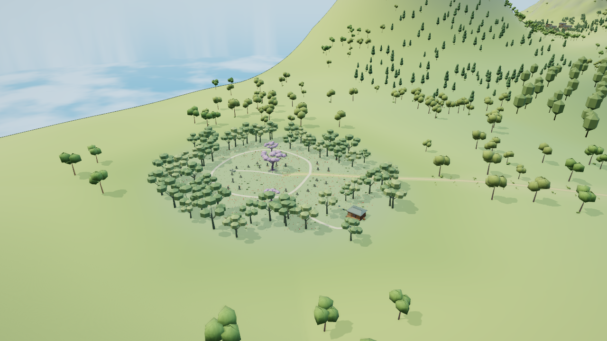
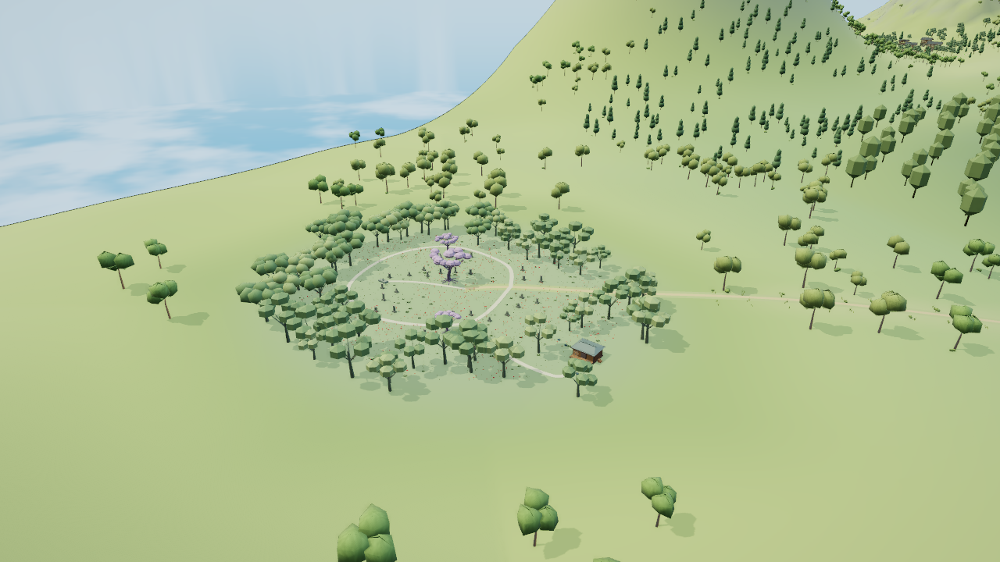
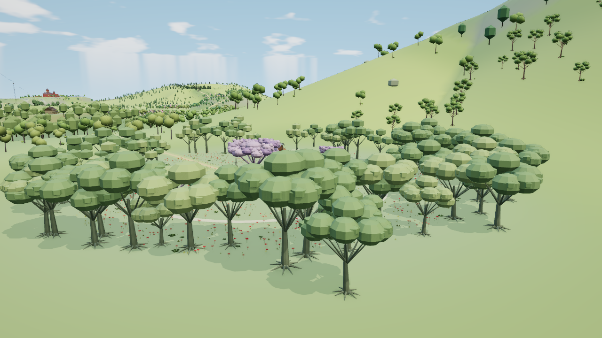
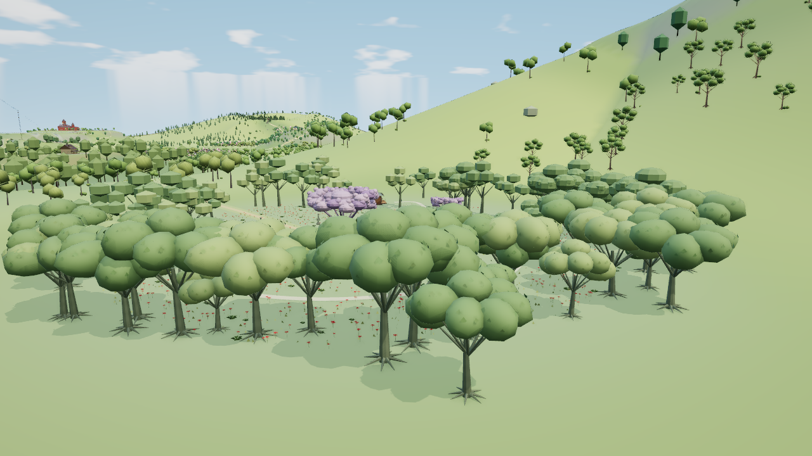

# 无缘塚西弧原树冠层

本阶段只精修西弧25棵原生普通树和冷总览中独立的10棵粗代理。真实同机位图、独立源码检查及生产交互／卸载重入已通过；最终组合Node45组通过，已随main b9ff4a3部署，不代表无缘塚或主岛整景完成。基线为main `504808ea4d297ba67a8cd435fd52282cde33ad74`，运行HTML为已交付太阳花田版本 `402224fe…`。

原画面最明显的问题是重复平盘冠形、内外圈冠形突变，以及林圈与空地之间缺少深度。这次以有厚度的枝端叶簇替换西弧平盘，补齐南端两株的同类衔接。没有移动原树、添加碎草或用文字制造画面变化。剩余37棵普通树、林分疏密、地形与林下层次仍需处理。

| 原始全景 | 本次全景 |
| --- | --- |
|  |  |

| 原始背面 | 本次背面 |
| --- | --- |
|  |  |

四张是未经图像加工的实际WebGL截图。六组实际检查还包含冷层、低画质及背面夜景；原声明的near机位被未改东侧前景遮住较多，只作为保护检查，不能代替完整近细节验收。背面机位能看到目标六批近档冠体。新冠仍偏圆，东侧旧冠与裸地并未随之完成。

## 范围和保护

源模块为[muenzuka-edge.js](../src/muenzuka-edge.js)，SHA `b2ef1b7c…`；范围x[-1840,-1760)、z[480,672)，仅六条`muenzuka:trees:-23:{6,7,8}:{0,1}:leaf`换近远原型。原63条记录的顺序、矩阵、颜色、枝干与根部、三株紫樱、棚屋、旧碑、供养台、彼岸花和路线均保持。地形高度、导航和人物没有变化。

冷层31株与原生62株有独立身份。原I7、I9分别拆出6、4株，保留其全部原矩阵／颜色和总数，只增加两条叶记录。冷转原生的密度差仍存在。

## 实际成本和包围修复

固定1280×720、DPR1、FOV49、clock12.5，正常档晴天AO开启、动态／人物／标签／Bloom／反射关闭，低档和夜景按各自已声明条件采集。表中都是同协议、同机位、同历史的基线差值；A与B会话的驻留结果不能交叉比较。

| 视角 | 调用增量 | 提交三角增量 | 属性驻留增量 | 纹理增量 |
| --- | ---: | ---: | ---: | ---: |
| 原生全景 | 0 | -900 | +38880B | 0 |
| A近机位（目标部分受遮挡） | 0 | -16590 | +287712B | 0 |
| A背面 | 0 | -27050 | +248832B | 0 |
| B冷总览 | +2 | -360 | +38880B | 0 |
| B低档全景 | 0 | -900 | +77760B | 0 |
| B背面夜景 | 0 | -27050 | -233712B | 0 |

新增唯一源缓冲共577780B（公共290068B，原生287712B），计入公共缓存中尚未驻留的近档原型。保持≤4调用、≤4000提交三角、≤0.6MiB唯一源缓冲及0新纹理的原预算。运行环境为SwiftShader，不声明实体FPS或物理显存改善。

真实独立检查发现Three实例球缓存不能覆盖所有近远切换及风动：原基线9组越界，未修候选10组、最大约0.234米。原CLI1保存于[隔离审阅提交32d4196](https://github.com/tianyin231/TouhouGensokyoAtlas/commit/32d4196916ed0296e4ac9828ff97f7b29615d43b)，没有删除断言或缩小冠体放行。

[局部渲染扩展](../src/muenzuka-edge-renderer.js)仅给六条目标原生叶记录及两条新冷叶记录设置覆盖两档真实几何与完整风动的保守球，不修改通用渲染器、LOD距离或GPU数组。24组原生近远缓存组合通过，最小余量约0.312毫米。接入后全景及A两张PNG与接入前逐字节一致；B组也在最终204输入、HTML `ce843445…` 上实际通过。

## 检查状态与恢复

根代理独立源码检查实际执行两次原生构造，12／12、CLI0，包含全公共前驱、25原树及31冷代理身份、所有非目标数组、共享缓冲、闭合冠体、风动包络和路径净空。原生几何固定值经过逐项审阅后仅更新Muenzuka一项：`fce019a1…` → `c0f2f137…`；不是测试自动刷新。检查器为[check-muenzuka-edge.mjs](../tools/check-muenzuka-edge.mjs)。

精简原始数值、全部输入与协议散列、失败、源码检查和图片绑定见[阶段证据](muenzuka-edge-evidence.json)。完整临时材料在`/workspace/muenzuka-evidence`，不提交dist、V8、整批取图或运行日志。

生产生命周期按同一协议各执行一轮：基线22／22、候选24／24，均CLI0；每轮各有三次真实Worker构造（输入检查、比较重置、重入），不能写成只构造一次。两版各22个独占原生GPU几何完全释放，公共数据保留，源值／资源六字段／程序键与引用／相机／wanted／LOD及PNG全部严格恢复；静止一秒0新绘制。候选四个主线程原型缓存和六个实际原生球、两个实际冷球均通过。只证明本轮有界恢复，不外推长期零泄漏；原始CPU观测不作提速比较。[精简配对证据与原协议](reviews/muenzuka-edge-lifecycle/README.md)保留完整输入、实际状态和报告散列。

最终208输入完整组合Node22实际45组通过，CLI0、1072.293秒，输入与HTML前后不变，见[组合回归](main-island-next-regression.json)。运行提交b9ff4a3的两组专项各14项通过、第二组场景五项通过；第一组场景check在20分钟边界取消，依赖对照跳过，原状态保留。两次Pages成功，最后发布包内HTML与验收c5327ca0逐字节相同，线上正文仍未核，见[CI证据](main-island-next-ci.json)。最终代码从最新main选择性整合，禁止合入32d4196的候选祖先链。主岛剩余目标与恢复入口见[主岛清单](main-island-upgrade.md)。
