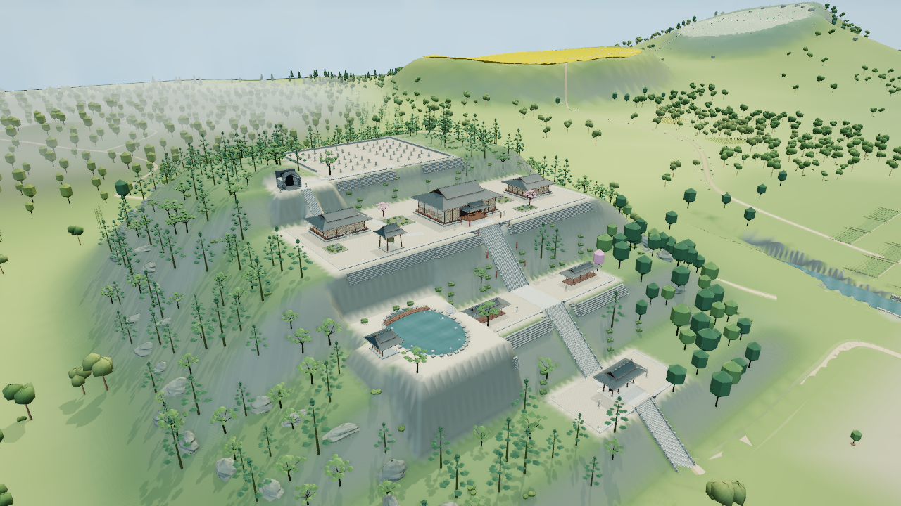
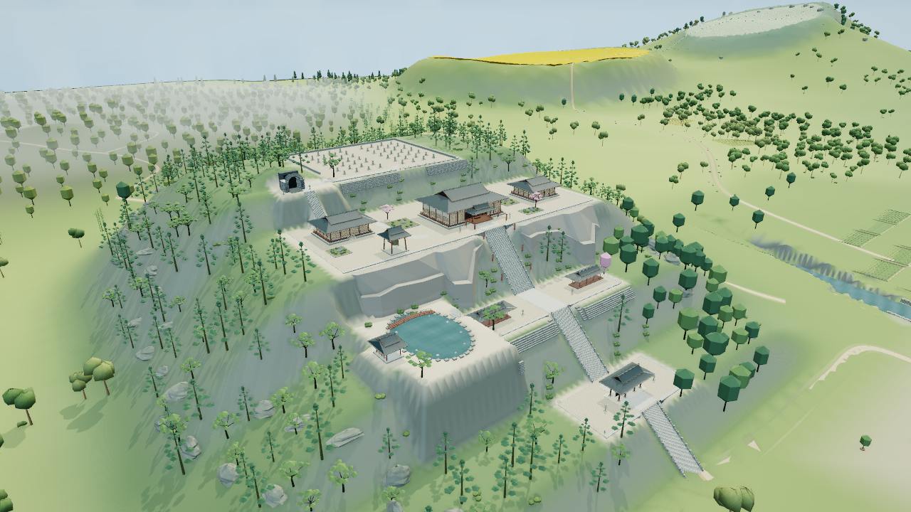

# 命莲寺闭合岩土体块：隔离审查记录

2026-10-05，基于main `261d5bfff5388cbf8192dbfd43445daf49183636`。本分支保存未通过美术门槛的单色体量稿，**不是可合入main的成果**。用户明确失败后换方法继续整体任务，无需等待逐步人工验收。

首稿以两翼各一个闭合实体代替旧高度场调色法：前伸坡脚、厚台肩、回收到平台底的上段。原地形、阶梯、平台、原树和墓地下层保持，仅精确移除4872原砖面三角。normal两体448三角，cut两体396三角，四体总属性91152字节，无新增纹理。

主代理及GPT-6 Astra Max分别查看真实同机位全景：体块和承托已能读出，但等高长檐像混凝土，尖竖片／长斜三角像折纸，实体与旧坡交叉造成拼贴感。尚未达到自然岩土体量门槛；不靠植物或纹理遮盖问题。下一步仅修订控制网的大面节奏与接合；若仍不成立，保存本方法并继续独立区域，整体任务不停。

Chromium151／SwiftShader，1280×720、DPR1、balanced、晴天12.5、AO开，动态／人物／标签／Bloom／反射关；eye `[503,226,167]`、target `[305,86,419]`、FOV49。最后一帧基线278调用／663480三角／29872584属性字节；V1为280／659056／29394792，纹理均24。无实体FPS测量。脚本错误及上下文事件0；唯一HTTP404实际定位为 `/favicon.ico`，不推断旧报告中的404来源。

四体实际闭合边／顶点连通／正体积／法向与阶梯带净空检查通过。独立源检查首次退出1：详情包 `pack.bytes` 高报526176字节（25325892→实际24799716），未放宽断言。完整Node、候选背面／昼夜／低档／剖切、原生重入及长回归均未运行。根目录已有主线进度文档为继承记录，候选状态以本页为准。

[审阅及hash清单](myouren-rock-clay-v1-review.json)。候选HTML SHA256 `f359834e7f85c6e0507da9b9d6167cb30cb25b1a207dbe522699d5e89b57903a`；构建产物不提交。源码冻结hash为 `279d0e6128b4c78ad6f104a9777215b90d6f9188592713c9a0c12aa3ca4a137a`。
