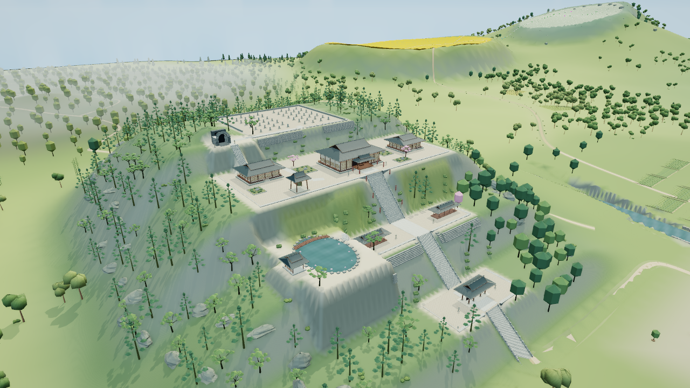
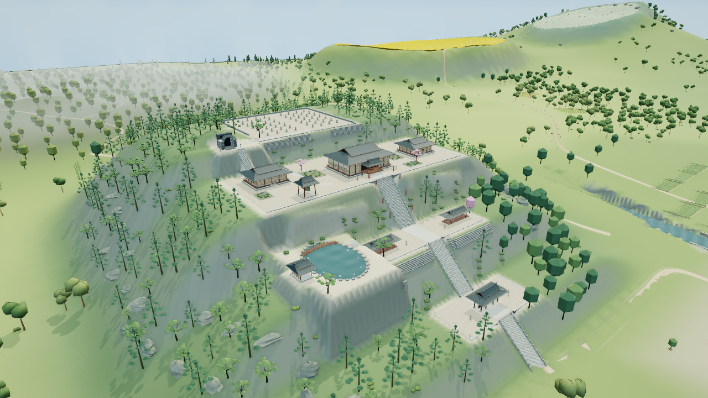
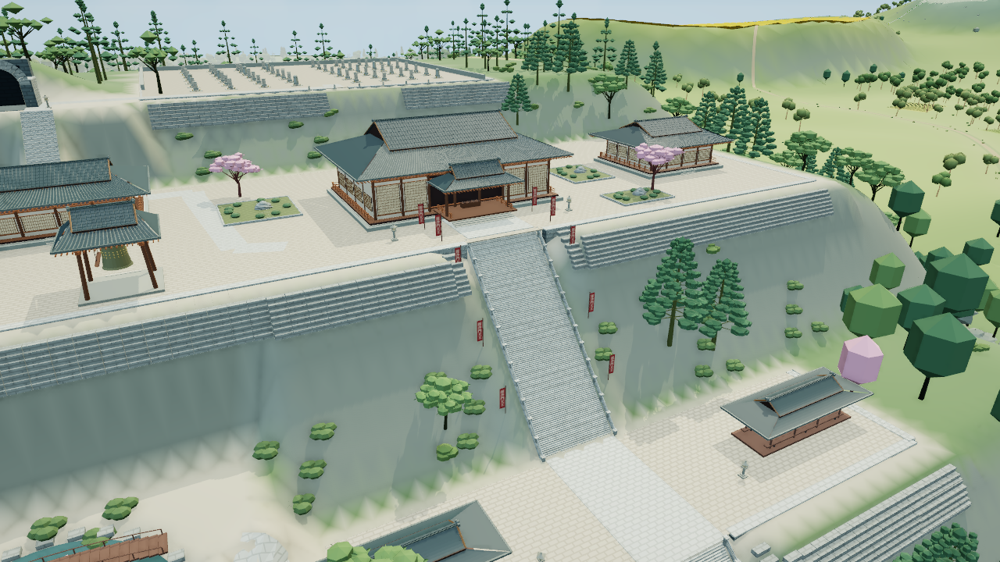
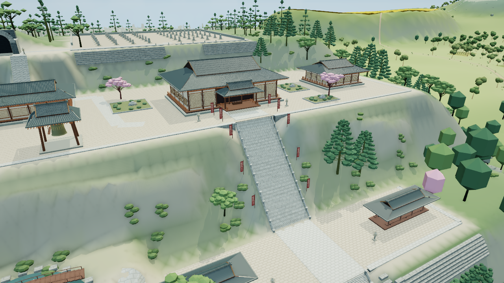

# 命莲寺主殿前坡：两稿拒收与恢复入口

2026-10-05，从重新核验的主线 `8f62a36a2af28118943e0922766c598f9ea98df3` 恢复。**此分支仅保存两次未验收候选，禁止作为画面成果合入main。** 已停止这一方法，不做V3或换区继续相同试稿。执行器接受并实际执行了 `gpt-6-astra`／`max` 美术任务与 `gpt-6.1-sol`／`max` 独立代码、性能及回归任务。

范围限定主殿平台正面两翼 x218–394、z354–391；中央14米登阶、平台建筑、六处原树根、墓地下层及其他已认可地区是保护约束。基线最明显问题为大块灰色陡面、重复横向砖皮与平台承托不清、锯齿坡脚及灌木缺少连续过渡。

## 真实画面与拒收原因

V1移除4872个重复砖面三角并调整原高度场，但整景仍为绿色陡板，竖向折痕和锯齿坡脚明显；逐顶点贴坡又将原灌木扭成绿石。源码及第一张对照保存在 [`006726b`](https://github.com/tianyin231/TouhouGensokyoAtlas/commit/006726b6c55212a9b65dc8c124fbfa20cbd4d325)。

V2改为两翼连续岩土台肩与局部2米重建坡面，原灌木只整体平移。主代理与美术代理独立查看实际全景和正面局部后仍拒收：肩台看得见，但长灰板、绿横带与不自然坡脚依然突出，扁灌木仍像悬贴石片，没有形成可信岩土结构。减三角不抵消这次画面失败。

以下均为未经修饰的真实WebGL截图。Chromium151／ANGLE SwiftShader，1280×720、DPR1、balanced、晴天12.5；动态、人物、标签、Bloom、反射关，AO开。全景 eye `[503,226,167]`、target `[305,86,419]`、FOV49；局部 eye `[352,151,295]`、target `[301,103,390]`、FOV49。

## 有限成本对照

先设预算：同机位最多增加4次全帧调用、4000提交三角、0.6MiB驻留属性，0新纹理。每个机位显式绘制三帧，下表取最后一帧；初次阴影失效帧另存原始报告，不当作生产调度测量。纹理均24，无实体硬件FPS或物理显存测量。

| 机位／版本 | 全帧调用 | 提交三角 | 驻留属性字节 | 几何 |
|---|---:|---:|---:|---:|
| 全景基线 | 278 | 663480 | 29872584 | 201 |
| 全景V1 | 278 | 658608 | 29346408 | 201 |
| 全景V2 | 280 | 659792 | 29407740 | 203 |
| 正面基线 | 223 | 1135670 | 32425452 | 169 |
| 正面V1 | 223 | 1130798 | 31899276 | 169 |
| 正面V2 | 225 | 1131982 | 31960608 | 171 |

两处V2样本为调用+2、三角−3688、属性−464844字节，仅说明样本未超预算。初始Worker构建、显式CPU提交样本保留，但单次数据不支持加载或交互提速结论。每次取图脚本／着色器错误0、上下文事件0，另各有1个未分类HTTP404，不宣称无外部错误。

## 验证边界与基线失败

V1／V2构建和真实两机位已执行。V2语法、空白差异、源包准备身份、精确4872砖三角匹配与索引视图不重叠保护检查已执行。中央阶梯、平台、原树和墓地下层仍是必须保留的约束，不能据上述局部结果宣称全部验收。

候选完整Node回归、独立V2几何／接地断言、背面／坡脚／昼夜／低档／总览／剖切候选实图、CPU交互／加载、卸载重入及长生命周期均**未运行**。美术门槛未过，未继续长回归。原V1静态检查草稿未适配V2、从未执行几何验证，未收入生产检查。

Sol单独运行的是原始主线基线原生卸载重入，退出码仍为**1**：32个命莲寺独占GPU几何全释放、CPU详情移除、公共记录保持与源数组哈希恢复通过；4批原树LOD由0变1使严格恢复断言失败。相机及273个wanted ID相等，LOD历史不同发生在原滞回区间202.4–257.6米。

基于已保存库存的有界诊断精确解释属性增加3528276字节：12个原有公共HLOD几何首次驻留、1个公共树实例属性，以及2个近树原型释放；133个程序键与引用数完全相同。渲染器总几何差中仍有**1个内部对象未归因**；严格最终资源相等与空闲零帧断言未执行到，不能宣称全程无泄漏。见[原失败摘要](myouren-slope-baseline-failure.json)与[对象归因](myouren-slope-baseline-ownership.json)。此基线诊断不代替候选验证，也不阻塞独立美术门槛。

失败协议脚本保存在提交 `5f9e51c`；它由撤销唯一后续冷锚点修订还原，运行开始时未记录脚本hash，此限制保留。当前[原生浏览器工具](../tools/check-myouren-browser.py)已将交互测试与相同冷入口锚点分开，严格断言未放宽，**仅通过语法检查、未重跑**。原先中止的基线重复取图退出143，不算测试通过。

## 冻结源码与下次入口

V2只新增 `src/myouren-slope.js` 并登记 `project.json`，未改渲染器、原源包或固定回归期望。公共原记录限8个地形兄弟、检查墙与1个命莲寺冷石面；近景限原砖面与坡灌木两条记录。四个追加坡面为正常／剖切兄弟，正常画面两块可见。完整hash、相机、样本及未测列表见[审阅清单](myouren-slope-review.json)。

候选HTML SHA256为 `c0cc8346476f76d34bc5393d05c5c5345406f40acb95d55092abb573a460c92a`，未上传产物、未部署。可从此分支重建，再用 `python tools/capture-myouren-candidate.py --dist <构建目录> --output <证据目录> --views myouren,front` 复现机位；取图工具不代表生产帧性能测试。

恢复必须从最新已验收main重新建立独立候选，采用**有厚度、闭合、具有明确硬面与裂隙的大岩土控制网**。先以固定全景单色体量验证轮廓、承托和坡脚，原高度场只约束接缝与基础；通过才接入材质与植物。不再重复平滑heightDelta加RGB混色，不以散草、标牌或换地区避开同一问题。完整主岛地形、树群疏密、林下层次和区域衔接仍待完成。
