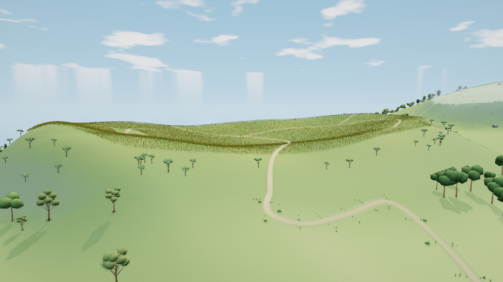
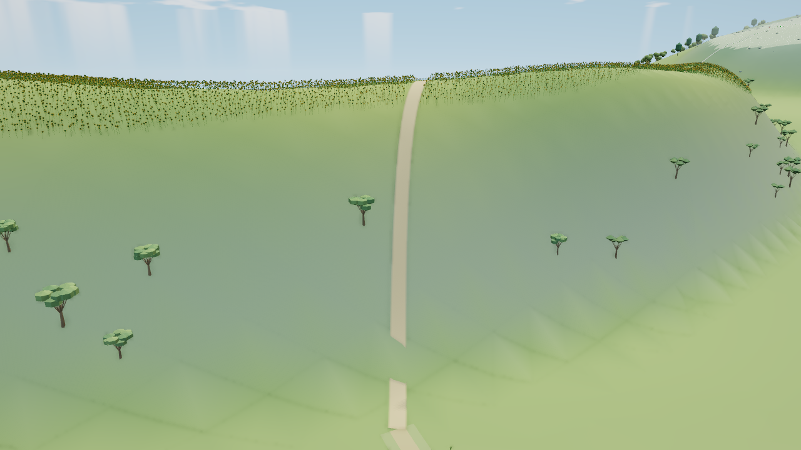
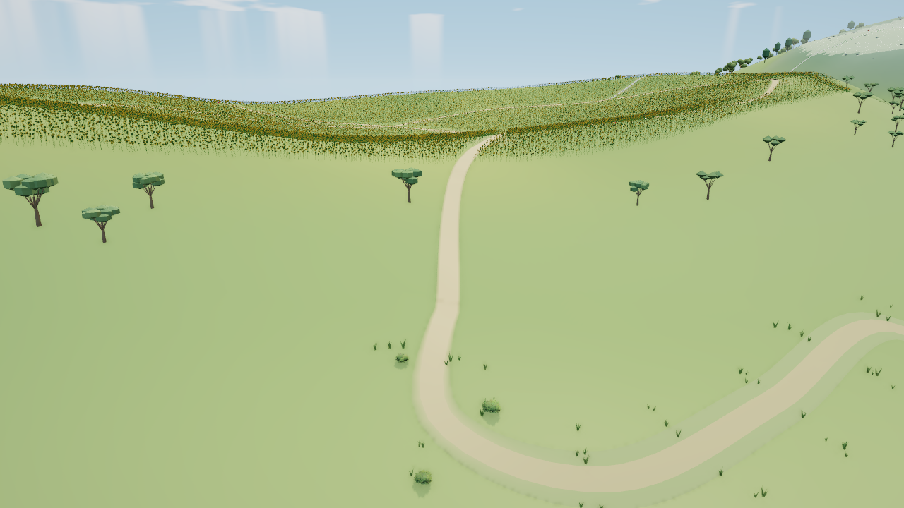

# 太阳花田北坡与入口交接

基于 main `9905a0918edbfb5708cda05582d5bf5d23d3d448`。最终北外坡与来路已通过七组真实同机位图审、成本预算、原生生产交互／一次卸载重入及完整 Node22 回归，作为本次局部成果交付。远端 CI／部署仍待该提交实际运行。本页不表示整片花田或主空岛完成。

冻结源码 SHA256 `7110e70da5feb19c8e163470c1d266e37ca40e8507e682915b188732be58984d`，HTML `402224fe67018c0fc33c6820f09d04cdea33b80914a79e62ca54de0e627bf8f8`，202 项构建输入。精确输入、原报告散列、图审、测量与未测项见[阶段证据](sunflower-entry-evidence.json)。美术由 GPT-6 Astra / Max 主推，GPT-6.1 Sol / Max 执行独立检查。

## 可见改动与保护

原北外坡是一整面陡板，来路在坡脚断开后直冲花缘。现在直接重塑原地形的完整坡体截面，形成宽坡脚、入口鞍部和两侧起伏，来路绕坡接回原生入口。没有新增草石、贴图或绘制记录。

| 原入口全景 | 最终入口全景 |
|---|---|
|  |  |

| 原同机位近景 | 最终同机位近景 |
|---|---|
|  |  |

范围 x[-896,-192]、z[704,1152]，12 对原 near/far 地形记录。内部碗形、原生步道 XY、回环、眺台、伞位、人物与导航身份保持。中央道路从村里原末段节点绕入花田，最后 56 米将宽度、路肩、抬高和切线接至原生入口，实际端面四角、法线和颜色一致。

所有树及原生花草保留 XY、身份、尺度、朝向和颜色，仅沿实际新地面调整 Y。公共旧末段路边的 112 株草与 8 株灌木，经原生成锚点唯一归属后随来路平移；其中四草和一灌木分别追加 0.14—0.55 米外侧净空，使用生产中的真实 near/far 原型验证。没有移动整批植株。

改变的 far 格采用对应 near 三角，外沿接回原 far 面。24 个原平台／伞支撑顶点保持；实际三角 contact 同时用于地面查询和原生构建，通用相机和渲染器未改。冷总览 5304 三角花毯是独立代理，单独重接地，不假定它与 124002 株原生花一一对应。

## 真实画面与成本

Chromium 151／SwiftShader、1280×720、DPR1、固定机位与同序采样。晴天12.5，除注明低档／夜间外均 balanced、AO开、人物／标签／动态／Bloom／反射关。首个阴影失效帧与后两帧分开记录；下表为相同稳定帧的全通道计数。

| 机位 | calls 前→后 | 提交三角 前→后 | 驻留属性字节增量 | 几何增量 | 纹理增量 |
|---|---:|---:|---:|---:|---:|
| 花田全景 | 1079→1079 | 6,736,942→6,737,839 | +51,804 | 0 | 0 |
| 入口近景 | 471→471 | 6,078,252→6,078,510 | +30,960 | 0 | 0 |
| 背向村里 | 737→737 | 3,139,597→3,141,451 | +50,716 | +1 | 0 |
| 低画质入口 | 505→505 | 5,960,029→5,960,287 | +30,960 | 0 | 0 |
| 夜间入口 | 506→506 | 6,257,437→6,257,695 | +30,960 | 0 | 0 |
| 眺台 | 389→387 | 5,464,093→5,172,977 | +19,984 | +1 | 0 |
| 主岛冷总览 | 1207→1207 | 1,649,875→1,653,180 | +126,636 | 0 | 0 |

全部满足预设 ≤+4 calls、≤+4000 提交三角、≤0.6 MiB 新增唯一源 backing、零新纹理。实际新增源 backing 612,060 B，含 contact 225,144 B；静态 far 地形 +3047 三角，道路 +258。旧森林 provenance 的 50,652 B 已补入递归 pack 账，它不是本次新分配。属性字节不等于物理显存；没有实体 FPS 测量。

眺台的提交三角下降有有限归属：共同 wanted／LOD不变，没有删除原可见记录，103个既有原生批次的bounds或实例Y因接地变化。渲染器先做宽松wanted筛选，Three随后按真实实例包围球裁切；这支持可见性改变的推断。原报告未记录实际提交批次ID，不能精确说少了哪两批，更不能称几何优化或FPS提升。无需为这项已在预算内且图审通过的降低再重复原生实验。

root 与 Astra 实际逐对审阅全部 14 张图。近景和低档的宽坡与完整绕行改善最明显；背向、远景、夜间和总览未见新断口或地形墙。眺台可见板面和栏杆保持，但平台完整底面被板台与花遮挡，不能称已看见完整底面。花缘过齐、花海重复细噪、裸坡空白和树群稀散仍未完成。

## 检查边界与失败保留

独立最终检查 27/27、CLI0，55.549 秒；完整生产前驱顺序、near/far 接缝、真实支撑面、路面接地与近远档植物净空通过。仅新增一次候选原生构建，最终几何散列 `f0e2d1871500518bedaf20c83d8ee71fb038fc61ee9f6d144428828444fce6ae`。六项原生保护比较明确复用原 V2 成对证据，不冒称当前重新测过旧原型／颜色／矩阵／建筑。仅审阅更新 `hakurei-baseline.json` 的 sunflower 值，其余地区及独立固定的旧散列不变。

七机位原基线 251.615 秒、最终 256.229 秒，均 CLI0；各自全量输入、HTML及执行脚本在采集期间不变。无脚本／shader／context 错误，仅本地 favicon404。采集总时长不是加载提速指标。

最终候选的原生生产协议 **12/12、CLI0**，256.671 秒。真实鼠标轨道与滚轮唤醒；29 个原生独占 GPU 几何全部释放，公共记录保持；重入后源码、相机、wanted／LOD、资源计数及程序引用严格恢复。原生前后PNG均为 `b61e4657517d6fc236de5f60a1667d2cb4eeaf13133f7d5c145dd813ce8ae6ee`，静止一秒0新帧，时钟保持12.5。协议不手动绘制或调用 GPU finish；只有一次循环，不外推长期无泄漏。原始输入事件后的单帧提交 CPU，原／新轨道14.6／9.2ms、滚轮10.6／11.8ms，不称提速或FPS改善。

原基线同协议仍是 **9/10、CLI1**，244.762 秒：其29个原生独占 GPU 也全部释放，公共记录保持，源码／相机／wanted／LOD恢复，但严格驻留断言102→92几何、15,278,924→14,429,500B失败。Sol按完整库存解释为11个wanted=false的公共暂留对象：九个冷总览建筑片加花毯，共10独占几何848,892B；另7株冷树的共享几何仍有其它所有者，仅减少矩阵448B和颜色84B。合计849,424B精确相符。现有renderer保留期6秒，回收只发生于绘制，连续三次wake不保证跨过保留期。旧基线后续程序引用、恢复图和静止帧断言因失败未执行，不由候选的通过覆盖。没有删除断言、补跑旧基线或改采样协议。

完整 Node22 **42组、CLI0**：19:02:09.126—19:16:46.595 UTC，877.462秒。202项构建输入及额外工作流等共240个绑定源文件，执行前后全部相同，HTML和release也不变，stderr为空。下一处只读基线取图曾与本轮重叠，整体耗时不与旧回归作性能比较。该提交的远端CI／部署尚待实际运行。

V1 整体坡体有收益，但硬直角和旧路边草线未接受，隔离提交 `1e7874e964f0f0cf04943960dc80cfc4caf14c2c`。首次真实启动也失败：错误把范围外共享神社实例当作写入目标，改为仅检查实际写入 view，未删共享保护。

V2 旧源码 `6d325f…` 的入口实图通过后，独立检查仍为 24/28、CLI1：21 个外缘缝、12 个眺台支撑点变化、5 株与路面的142对交叉，以及旧 provenance 账少50,652 B。该源码、精确检查器、实图与失败已隔离为 `c5d8268bc3f885f095bb1e5e9aa74255fd2a2831`。最终修复截面越界、保护真实支撑三角、使用生产五簇灌木做净空，并递归计数；不会合并隔离祖先。

早期纵坡／预算失败、起接边2.506毫米误差、额外伞脚细分造成9条新缝、raw原型仅复现25对交叉的误诊均保留于工作区原报告及隔离审阅记录。

## 恢复入口

实现 `src/sunflower-entry.js` 最后登记于共同 worldBuilders；`G.SUNFLOWER_ENTRY.prepare`、`metadata`、`sampler` 和 `originalBuildRegion` 提供有界检查入口。`tools/check-sunflower-entry.mjs` 保留完整成对 `--native`，候选单测的证据复用需要显式原报告及散列；公共集成不依赖工作区临时文件。浏览器协议为 `tools/check-sunflower-browser.py`。原始图、CLI输出及执行快照在 `/workspace/sunflower-entry-evidence`。

后续从实际最新 main 接续花田西缘至无名之丘的坡鞍，先取真实基线，不覆盖本阶段地形或假定整个花田完成。命莲寺、森林／人里／湖岸的隔离失败及全岛剩余清单继续保留；其它独立空间不扩展。
