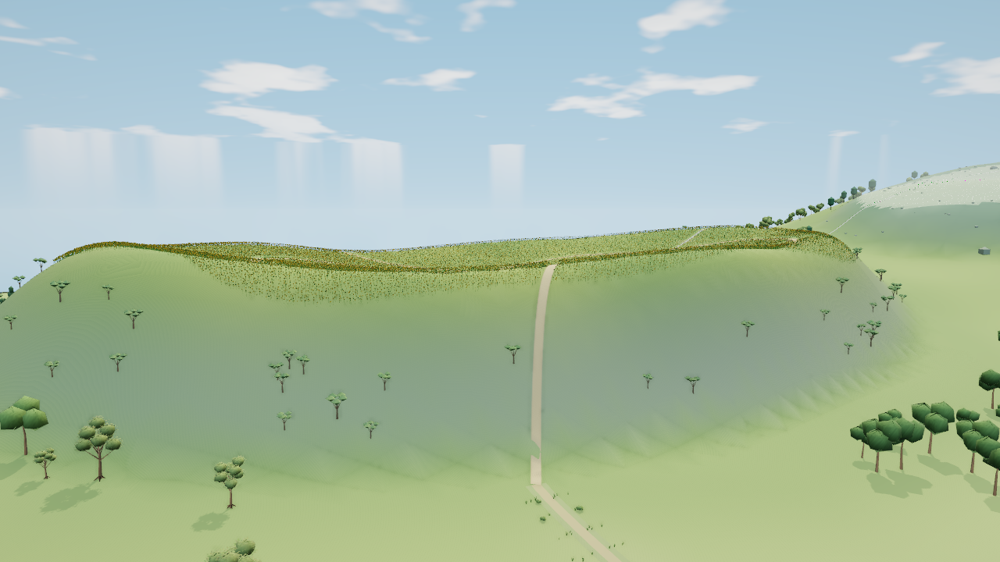
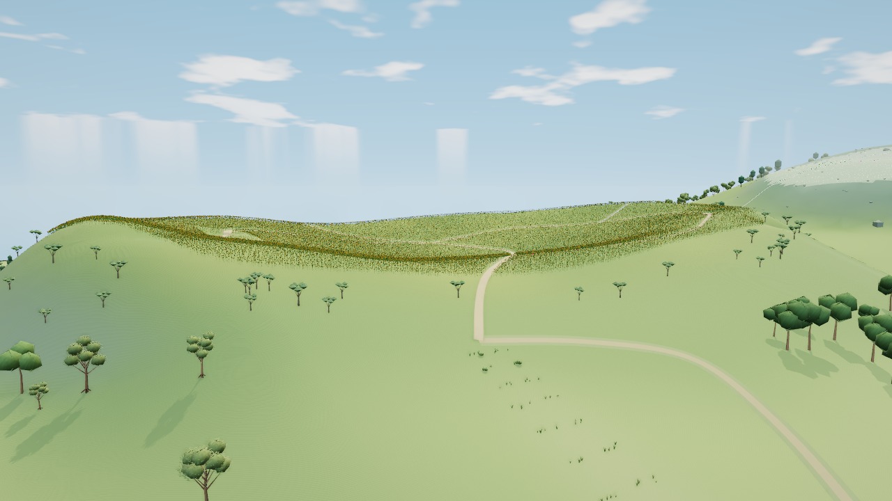

# 太阳花田北外坡 V1：隔离评审

基于 main `9905a0918edbfb5708cda05582d5bf5d23d3d448`。本分支只保存候选与实际画面，不代表已交付，不应整支合入 main。

整片陡坡已改为宽坡肩与较低的入口鞍部，原树得到实际地面承托，整体轮廓有可见收益。但公共来路和原生花田小径形成明显直角，旧路边植物仍留下另一条路线痕迹，因此首稿未通过交付验收。下一稿限定修正切线、道路和路肩的完整横截面；仅按可核定的原记录迁移对应草／小灌木，不新增散草遮盖问题。

同机位、1280×720、DPR1、晴天12.5时、balanced画质的原始图：

这张实图保持506次全部通道提交、92个几何与11个纹理，三角增加192，驻留属性增加23040 B。它仅是固定镜头的SwiftShader计数，不是硬件FPS或物理显存测量。源包新增唯一backing 605988 B含225144 B接地数据，仍待独立检查。完整来源、PNG与产物散列、原始退出码见[精简证据](sunflower-entry-v1-evidence.json)。

第一次真实启动在取图前因共享实例保护的目标过宽退出1，零帧；原失败保留。当前只修实际写入目标，未删断言、未拆分神社共享资源。修复后入口取图54.890秒、退出0，200项输入与HTML在执行前后不变，未见JS／shader／context错误；只有favicon404。

作者早期原型／颜色脚本误遍历汇总表，实际检查0条，明确为未测。背面、近处、低档、夜景、总览、独立源检查、真实交互／卸载重入、完整Node、此候选CI及部署均未运行。V1源码与当时产物200项输入逐项一致，本分支不改任何固定几何期望以凑通过。
