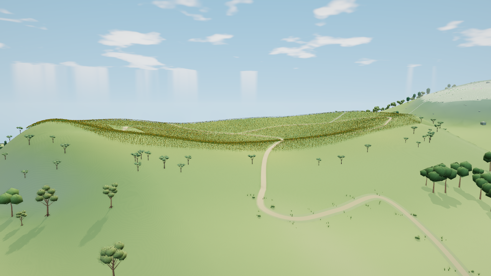

# 太阳花田北外坡 V2：画面通过，技术检查阻塞

V2 延续首稿整坡，将入口直角修成连续弯道，原来穿过空地的草痕随新路收束。root 与 GPT-6 Astra Max 独立看过实际同机位图，接受本阶段的坡体和来路变化；坡面空旷、齐整花缘、稀散树形及林下仍是后续欠项，不能称整片花田完成。

实际图运行56.095秒、退出0，200项输入与HTML前后不变，无JS／shader／context错误。与基线相比，全部通道506次提交不变、三角增加258、驻留属性增加30960 B、92个几何和11个纹理不变。[帧证据](sunflower-entry-v2-frame.json)记录了具体机位和散列；这些SwiftShader计数不代表硬件FPS提升。

GPT-6.1 Sol Max 随后运行一次完整有界检查，包含两个实际原生构造：81.157秒、退出1，28项中24项通过、4项失败。原始失败与准确工具快照都保留，未修改固定几何期望。

- far/fine交界有21个失败采样，示例最大0.11675 m，部分落在声明包络外。
- 原眺台下方实际地面12处发生变化，最大0.12912 m；只保护高度查询不足以保护渲染三角。
- 迁移的灌木等仍有142组实际三角交对侵入新路，需修净空。
- 公共pack.bytes少计50652 B，需按对象归属修正账目；不是物理显存测量。

精确120株迁移归属、其他矩阵分量、冷代理属性、道路两端接口、原生花木原型／颜色／株数／建筑／范围均已通过非空检查。公共路实测最大纵坡27.6425%，原生包络段28.2673%，两者采样范围不同。详情见[检查摘要与原失败](sunflower-entry-v2-check.json)。

本分支仅隔离保存候选，不合入main，不部署；后续只修这四项并保留已接受形态。完整Node、候选其它视角验收、原生交互／卸载重入、候选CI及部署尚未运行。旧V1档案仍保留。
