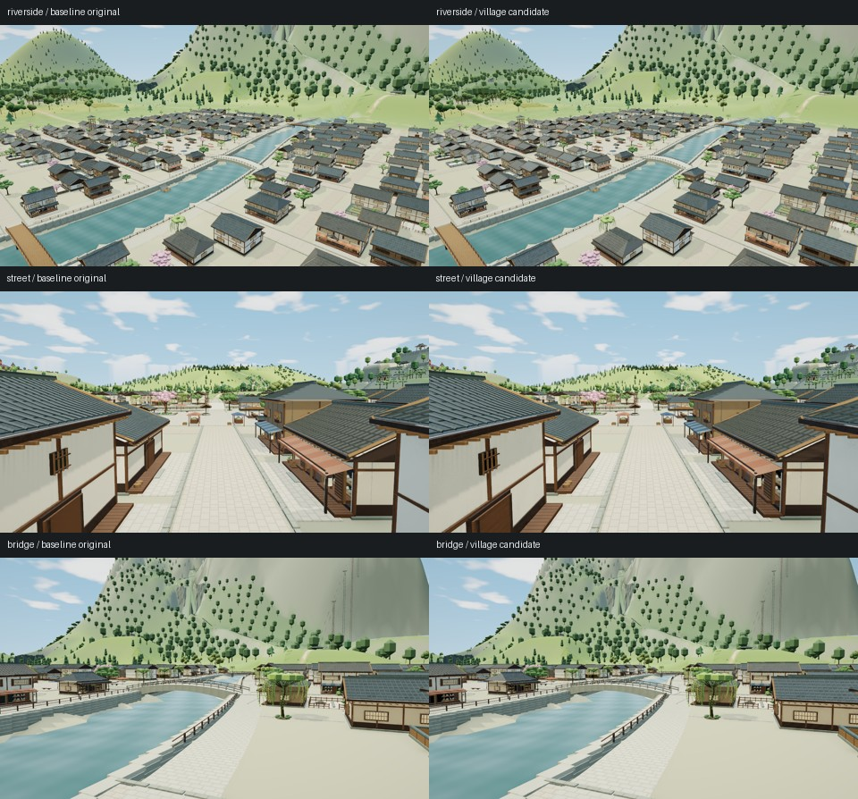

# 人间之里材质、远景与桥头交接

基线为 `e01be66a26716f38535dde18cceb688f47131815`，应用 HTML 与森林连接提交 `096849a` 相同。范围限于既有人间之里和三座河桥的六个桥头，保留226栋住宅、140处院落、市场、河道、原路线、全部实例位置和颜色；不增加地区、角色、灯光或贴图资源。原树继续保留。

本阶段的材质、远档和公共桥头已通过本地验收：三个白天机位、三个低角度桥头、一次原生卸载重入和完整Node22检查通过。原版同机位补拍确认东石桥路沿的暗三角轮廓已经存在；候选局部颜色有变化，具体深度或阴影成因未证明，既有路沿折面仍待后续精修。本阶段不代表人里所有道路细节都已完成。构建为171项输入、36,019,480字节 HTML，SHA-256 `8fd6a6489b1c5260b7942d8e50f56eff646cb830d9ab29d785c01fb1de6750e6`。精简证据见[审阅记录](../tools/village-upgrade-review.json)。

## 外观与成本

沿用香霖堂的木纹、瓦面、石面、纸面和凹口表现，以原尺寸分类表面，保持原建筑轮廓和近景几何。32条屋瓦／木构批次，以及石块、灌木、陶罐使用较轻的远档；近处低画质仍保留应有构件。远处河岸砖缝会减少，不能称所有距离的细节完全相同。

以下为 Chromium151／SwiftShader、1280×720、DPR1、balanced、白天12.5、晴天、AO开启的固定机位统计；三角数包含提交实例，属性字节是驻留几何统计。相机、光照、植物和其他地区的源数据保持。

| 机位 | 提交三角：原版 → 修正版 | 驻留属性字节：原版 → 修正版 | 绘制调用：原版 → 修正版 |
|---|---:|---:|---:|
| 河岸 | 3,476,270 → 3,264,856 | 150,182,822 → 121,917,238 | 820 → 829 |
| 街道 | 2,453,590 → 2,148,730 | 136,809,964 → 102,884,292 | 374 → 377 |
| 桥畔 | 3,011,535 → 2,813,385 | 149,851,188 → 122,655,710 | 688 → 694 |

三个机位的三角提交减少6.08%—12.43%，驻留属性减少18.15%—24.80%；绘制调用增加3—9次，程序增加2—5项，纹理均保持11个。软件渲染统计不代表实体设备FPS，属性字节不等于物理显存。没有新增ABBA或GPU帧时实验，不宣称所有成本都下降。

实际生产Worker的人里包仍为316条记录：234条主体加82条原植被记录，源backing从172,676,568降为163,789,316字节，约减少5.15%。三个冷加载观察中，原版build为1,894.5／1,936.3／1,853.7毫秒，候选为2,373.3／2,199.5／2,196.7毫秒；候选自身记录的额外处理为406.5／368.6／379.2毫秒。首次生成有额外成本，不能称加载变快。任务开始至消息接收、就绪观察上界及静态暖场分别保存，finish时间包含在额外处理中，不能再次相加。

## 实现与保护

相邻quad仅在位置、法线、颜色和材质分类逐位相同处共享索引，不做逐顶点字符串去重。材质分类与方向在Worker预先写入两字节Uint8属性，与顶点共享可转移ArrayBuffer；主线程只建立属性视图。8条原总览记录、材质和数组完全保留，总览新增backing为0。近景按原顺序展开后，1,607,023个源三角的位置、法线、颜色位模式不变；计入实例后为2,623,234个三角。

桥头永久归属公共地表，不随人里详情卸载。六个桥端分别适配近景桥／总览桥及近／远地形，共24条记录、288个源三角、31,104字节属性；每端同时最多显示一份，最多绘制72个桥头三角。选择委托原渲染规则，不另复制焦点、邻区和缓存阈值。总览桥按实际顶边收口，不能用原近景桥尺寸推算。

CPU检查覆盖216个实际绘制地形接触点、48个桥内角和672组继承选择状态；12条近景桥头与上一版逐位相同。资源检查覆盖真实转移和detach、尾部对齐与别名、失败回滚、近远索引隔离、卸载和重入、最终驻留清零；100个近远材质属性数组与独立冻结分类函数一致。

## 验收记录与边界

三个日景共9张稳定PNG、91项命名检查和6次像素稳定比较通过，CLI退出0。逐项保护2,190条源记录；233条合法变化用独立参考核对，24条新增公共记录逐字节匹配独立桥头证明。全部实例与颜色、82条原植被、8条原总览、布局、路线和其他地区不变。无脚本、着色器或上下文错误；每个新会话各保留一条未归因HTTP404，不能写成没有资源消息。

Node和Chromium生成的原始数组摘要存在差异，因此浏览器期望来自同一Chromium版本的独立空白页Worker。原版234条主体先与原截图源摘要严格匹配。候选仅一条记录在相邻索引合并后比Node多保留四个顶点，顶点与finish合计多152字节；仅批准两个确切数组长度，未引入数值容差，具体底层浮点原因未作证明。材质明度修正后，完整Worker文本和几何输入不变，严格重绑构建后复用该独立参考，不从待测应用生成期望。

最初材质继承香霖堂显式环境强度，导致整村偏暗，虽技术检查通过仍被拒收。最终普通表面重新继承原场景环境，新增桥头继续使用香霖堂石材策略，凹口按实际环境强度有界衰减。16组环境状态和实际恢复入口的CPU检查通过，三个受影响日景重新捕获并接受；旧偏暗图与旧完整回归仍单独保留。

该构建的完整Node22.23.3检查实际退出0，用时801.033秒，包含最终源码的672组桥头选择和16组环境状态。桥头三个低角度机位各三张稳定图和一张冷加载代理图的技术检查通过，CLI退出0；一次原生清缓存重入中，316条详情移除并恢复，全部源数据哈希还原，公共24条桥头保持，旧详情引用检查为0。四种已捕获画面均实际看图接受。桥段与完整CPU检查并行，不用这段耗时作性能结论。

东石桥补拍仅一个原版机位、三张稳定PNG，CLI退出0；2,423条原源签名、相机、实际灯光和设置与独立基线严格匹配。实际原图也有同处暗三角轮廓，候选部分像素更暗、更偏绿，不能写成逐像素不变。元数据投影重建未匹配原顶点完整SHA，只作定位线索，不据此归因阴影或遮挡。本阶段保留原有路沿折面，未为该疑点额外更改模型或补做全图实验。

远端CI与Pages以本次提交Actions为准。本地白天验收不等于新增夜景、全地图压力或实体设备性能结论。

## 恢复

工作树 `/workspace/village-refinement`。最终候选和独立参考冻结于 `/workspace/scratch/village-runtime-v3-fill`、`/workspace/scratch/village-chromium-reference-v3-fill`；日景证据在 `/workspace/scratch/texture-experiment/village-candidate-v3-fill-day`。旧v1／v2额外内存与主线程成本、v3偏暗图、跨VM导出失败及独立参考首次严格长度失败均保留，不能改写为通过。正式Git仅包含必要源码、检查、精简记录与一张预览，不包含原始批量截图或临时构建。
