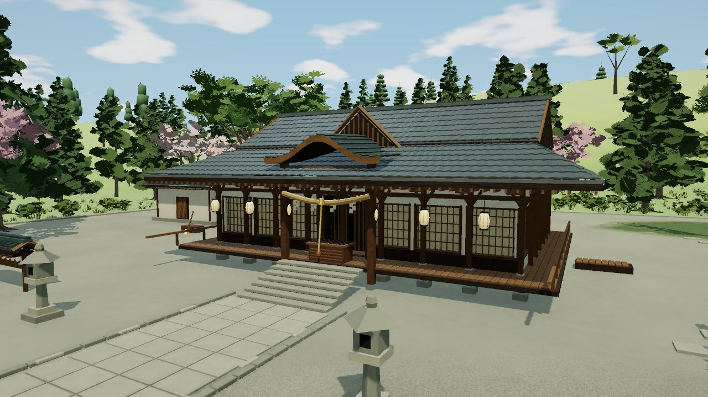
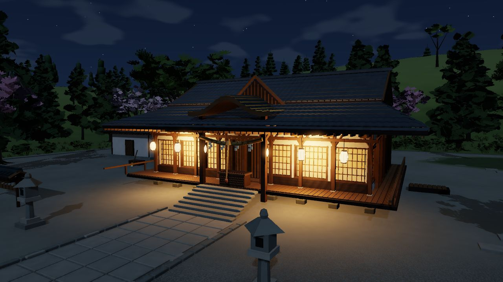

# 区域画面升级交接

> 2026-09-29：以博丽神社为画面试点，整合远端 `ca737d6`（v0.29）的伪天棚与山地赌场。后续按区域逐渐提升，保留高地及全部已有场景。最终构建 SHA、合并后核验与未测项见[当前状态](current-status.md)，本页不代替验收记录。

浏览器 Chat 接手时，先读根目录 [AGENTS.md](../AGENTS.md)、本页和[当前状态](current-status.md)，再定位实际源码。不要仅凭旧对话或预览图判断当前实现。基础要求继续遵守[美术规范](art-and-modeling.md)、[工程约定](engineering.md)和[开发流程](development-workflow.md)。

## 2026-09-30最新：河童黄瓜田

黄瓜田以边远栽培实验的文字依据构建，不把普通药圃换名，也不推断为工厂或角色住所。具体设计见 [黄瓜田交接](cucumber-farm-handoff.md)，实测与失败边界见 [当前状态](current-status.md)。本轮仍保护原连续地形、旧树、神社和已有地区。

最终完整专项仍发生1次上下文丢失并恢复，严格历史断言失败；三组同机位对照无错误或上下文事件，神社日夜PNG均逐字节一致。这两类结果必须分开。

重点为分段藤架和采收道、果叶轮廓、开口收获棚的承托、静态渠槽及近远接地。先修正来路贴近旧树、规则围圈植栽和果实尖硬等问题，再增加细部。不得用共享数组较小宣称GPU成本低；近景实例展开与画质切换成本仍须实测。瀑后洞穴只导览关联，未建完整物理运输线。

## 2026-09-30此前：瀑后洞穴

仅补入口与独立轨道洞段，原瀑布、山体与旧树保持。来源细化到《铃奈庵》28话P16–17文字转录，远处黄瓜田仍未建。首稿洞口与支路避开旧树，两个被原山体遮挡的广角机位抬高后重新拍基线；不靠删除旧内容改善截图。

最终32项专项通过；另有长批量截图发生上下文丢失，必须保留失败。神社日夜另用四个新会话对照，PNG一致。洞口外壳仍偏规则、岩层和石基接缝待精修，不能称美术终稿。成本、条件、失败和未测见 [当前状态](current-status.md)及[瀑后洞穴交接](waterfall-cave-handoff.md)。

## 芍药田历史增量（2026-09-30）

仅补芍药田，来源和P边界见 [芍药田交接](peony-handoff.md)。先实机查看旧坡地，再补五带花畦、321丛共享实例芍药与小作业棚；初稿尖瓣、浮腿和道路材质断色已修。原地形、旧树、神社与全部旧建模源码保持。

完整专项长会话两次在低档末段发生上下文丢失后恢复；正常UI短路径通过不能抵消它。**本轮不是完整浏览器稳定性或美术验收通过。**近景实例三角形成本、日间神社1/255微差、空白失败图和有效补充图分别记录于 [当前状态](current-status.md)，不得用测试配置值代替看图。外围仍偏空、花畦偏整齐，需要继续精修而非继续堆花。

## 2026-09-30后续：迷途之家

PR #2与#3已合并，基线为 `d1efe95f`。本次仅补建迷途之家，具体来源、P布局、11机位及复测入口见 [迷途之家交接](mayohiga-handoff.md)，当前结果见 [当前状态](current-status.md)。

先在实机中否定过高的山腰石基，移至缓坡而不改变连续地形；为屋体补门洞、侧窗、厚檐、柱脚、背墙和残屋缺瓦。树冠遮挡预设时调整镜头，不通过删除旧树制造对照。村落仍需进一步做荒废痕迹、树形与地表细节，当前不是已获用户认可的美术终稿。

以下神社标准继续作为质量要求。建筑与入口身份、几何测试、浏览器运行、用户美术接受是不同状态；不能因本区专项通过而抹除共享WebGL问题的历史失败。

## 圣域／浅间净秽山首次搭建记录（2026-09-30，待精修）

新增8项局部选景与27机位，源码和来源见 [本轮说明](asama-handoff.md)，最新实测与失败记录见 [当前状态](current-status.md)。以下神社标准继续有效；不能因为目录已可导航就降低美术验收要求。

本轮神社夜景固定PNG逐字节一致，日间最大通道差1/255；调用和三角形计数保持。圣域连接路的尖边／陡坡路肩、树冠和地下岩壁仍需精修；前一会话轻量档的着色器链接失败尚未定位，最终同源码串行50项通过不代表根因已修复。当时记录不代表全域美术验收通过。总览追加轻量构建，不改神社源包或复制神社整套材质植被数值。

## 神社试点实际改变（2026-09-29记录）

- **建筑与材料**：保留拜殿尺度、神社中轴与 140 级登山石阶；改善真实门窗开口、入口暗腔、缘侧木构、屋瓦轮廓、石材边缘及庭院。木、瓦、石、砂砾、苔地、纸、漆分材质处理，木纹顺着构件方向，细粒度随距离减弱。
- **植被与地面**：核心树使用枝干与裁切叶簇，增加随坡贴地的树根、林下草灌和零散石块。叶片透光来自漫射受光，避免靠自发光把树林提亮。
- **周边衔接**：沿用外围原有树点位、数量、朝向和尺度，用轻量枝叶逐渐接回旧树形；地面色调在局部范围渐退，保留连续地形与道路。
- **可切换夜晚**：地表增加日间／黄昏／夜晚，夜空、月光、水面和雾随时段变化。仅神社完成暖灯、纸门和庭院夜景精调，其他地区尚未逐一设计和视觉验收夜景。独立世界继续使用各自照明。
- **基础修正**：AO 深度取样与反投影对齐同一像素中心，修复条纹；夜间同步控制场景环境反射，避免周围山坡仍呈白天亮度。

预览仅展示代表性实机角度；对应版本与测试范围以[当前状态](current-status.md)为准。神社背面、庭院排布和尺寸继续保留 P 补完性质，不是原作测绘，也不是完整室内。

## 后续画面标准

- 保持正常天空下的一整块连续幻想乡空岛。区域边界必须有土地、道路、坡地与林缘，加载边界不能变成地形切口。
- 先让远景轮廓、中景空间与路线成立，再改善近景开口、厚度、接触和材料。不能用密集噪声、道具堆积或一层“贴墙门窗”代替结构。
- 材料变化有真实尺度和方向；干燥木石保持克制反光。不要为了质感把所有物体改成湿亮塑料，也不要用黑缝、强 AO 掩盖穿插。
- 关闭雨、Bloom 和 AO 后，主要建筑、植物体积与材料区别仍应清楚。晴天是基础验收条件；夜景额外检查冷暖主次、暗部可读性和光源位置。
- 建筑背侧、台基、树根和水岸与正面同等检查。不同地区保留各自建筑与植被特征，不复制神社模板换色。

## 每个地区按六步推进

1. **核对当前版本**：记录 HEAD 与工作树，先合并远端新增内容并保留用户改动。读取地区来源、实际构建入口、渲染继承链和源包关系；需要新增事实时才调研。
2. **固定基线镜头**：真实浏览器查看晴天区域全景、正面近景、背面、低角度地基、连接道路；保存相同画质和机位的改前图，记录分辨率、DPR、天气与时钟。
3. **定位主要原因**：区分轮廓／厚度、门窗进深、材质尺度、受光、植被体积和环境突变，先处理最影响中景的两三项，不同时重造全图。
4. **实施局部升级**：先结构，再材料，再植物与生活细节；新材质限制到本区。保留原地点、路线、来源与 P 标记，按区生成并复用现有缓存和资源回收。
5. **补过渡与成本控制**：将核心细节分层降级，外围复用低精度原型；检查总览和详情切换、相邻地区及连续移动。必要时显式更新总览源包，并证明未触及其他地区。
6. **验证与交接**：构建、固定检查与真实视觉对照一起完成；查看控制台／着色器错误，检查跨区及昼夜恢复。记录本次证据与未测项，更新当前状态和少量代表图，再按用户授权提交／推送。

## 性能与环境过渡

几何细节用于轮廓、厚度和会投影的结构；细小表面颗粒优先由材质表达。实例共享、近远精度、按距离隐藏和按需绘制沿用现有机制，不先生成全图高模。

神社当前参数是试点参考，不是所有地区的统一预算：

| 层级 | 当前处理 |
|---|---|
| 近景建筑与植物 | 木架／叶冠在约 120／240 米使用远档；草、根及零散细节另设距离限制 |
| 材质细节 | 高频噪声随距离和屏幕像素覆盖减弱；远处保留大色块与粗糙度区别 |
| 外围树林 | 210—330 米按概率渐退；100 棵原树原位替换，木叶共 4 批，单树不超过 180 三角 |
| 公共地面 | 神社周边材质影响在 150—215 米渐退；不相交的地块继续使用原材质 |
| 夜间灯光 | 复用 4 盏局部点光及原主阴影，不新增点光阴影贴图；轻量及雨天沿用关闭实时主阴影的规则 |

外围树属于公共地表，不能依赖神社详情包的生命周期。不要通过加密一整圈高模树掩盖边界；同时处理轮廓、叶色、地面颜色和疏密，避免规则圆环。

合并前 v0.28 工作阶段记录：神社详情 144 网格、源数组约 12.29 MiB；固定广角、精细画质、关闭 Bloom 的优化前后三角数由 633,907 降至 540,375（约 14.8%），调用由 166 变为 169。这是相同条件下的历史比较，不能当作合并后成绩或 FPS 保证；源数组字节也不等于总内存／物理显存。

## 真实视觉验收与已知踩坑

- 使用本轮构建的 WebGL 画面；截图不能由生成图、全景贴图或概念图替代。除定点图，还要沿连接路线连续移动，观察材质突变、树冠跳变、穿插和区域卸载。
- 至少检查正常晴天、关闭后期、轻量档及背面；涉及夜晚时增加日→夜→日、夜雨、独立空间往返。画面接受、代码完整、测试通过和性能指标分别记录。
- 夜间退出必须恢复天空材质、`ambient.color`、`scene.environmentIntensity`、局部灯参数和水面状态。只调 `material.envMapIntensity` 无法压暗使用场景环境贴图的公共地面。
- 渲染器以继承链叠加。神社材质层先于夜间层加载；合并高地等新模块后重新核对顺序，检查其独立局部灯是否在离开时关闭。
- GLSL 不使用保留字 `patch`，苔地变量保留 `mossPatch` 等合法名称；屏幕导数在条件分支汇合后计算，避免局部纹理异常或整块地面消失。
- 裁切叶片的可见材质与深度材质需匹配 alpha 阈值；额外 UV、纹理与深度材质要计入原引用计数和释放流程。
- 固定几何／文件基线不在测试时自动更新。共享代码或源包有授权改动时，先核实差异与其他地区输出，再明确更新对应保护项。
- 未运行的设备、地区或长时间压力测试明确写未测；软件图形后端截图不能替代真实显卡或手机帧率验证。

## 源码与核验入口

| 入口 | 用途 |
|---|---|
| [world-builder.js](../src/world-builder.js) | 神社建筑、屋瓦、立面、庭院及材质分类 |
| [hakurei-plants.js](../src/hakurei-plants.js)、[hakurei-transition.js](../src/hakurei-transition.js) | 核心植栽、近远原型与外围原位过渡 |
| [hakurei-renderer.js](../src/hakurei-renderer.js)、[night-renderer.js](../src/night-renderer.js) | 神社材质与地表日夜；本轮保持原文件 |
| [renderer.js](../src/renderer.js)、[app.js](../src/app.js) | 公共渲染成本、光照状态和界面切换 |
| [project.json](../project.json)、[index.html](../src/index.html)、[build.py](../tools/build.py) | 建模同源列表、渲染器加载顺序与构建内嵌 |
| [check-hakurei.mjs](../tools/check-hakurei.mjs)、[hakurei-baseline.json](../tools/hakurei-baseline.json) | 13 个旧主区域几何保护、神社源预算及外围树矩阵检查 |
| [update-hakurei-overview.mjs](../tools/update-hakurei-overview.mjs) | 显式更新神社总览源包，并核对其余批次几何；不是常规构建步骤 |

常规执行 `python tools/build.py`、`node tools/check.mjs`，通过本地 HTTP 打开生成的当前版本 HTML。神社近景可用 `#view=shrineFront&lighting=night`，广角可用 `#view=shrineDiorama`；版本文件名以 `dist/release.json` 为准。构建检查不等于所有地区视觉验收，浏览器操作、图片和性能证据另行核实。
