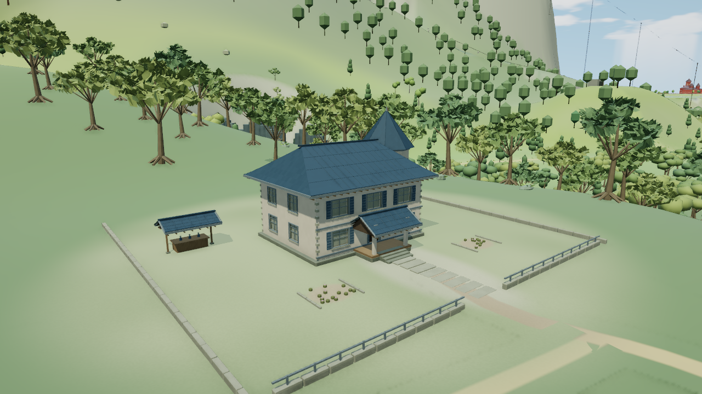
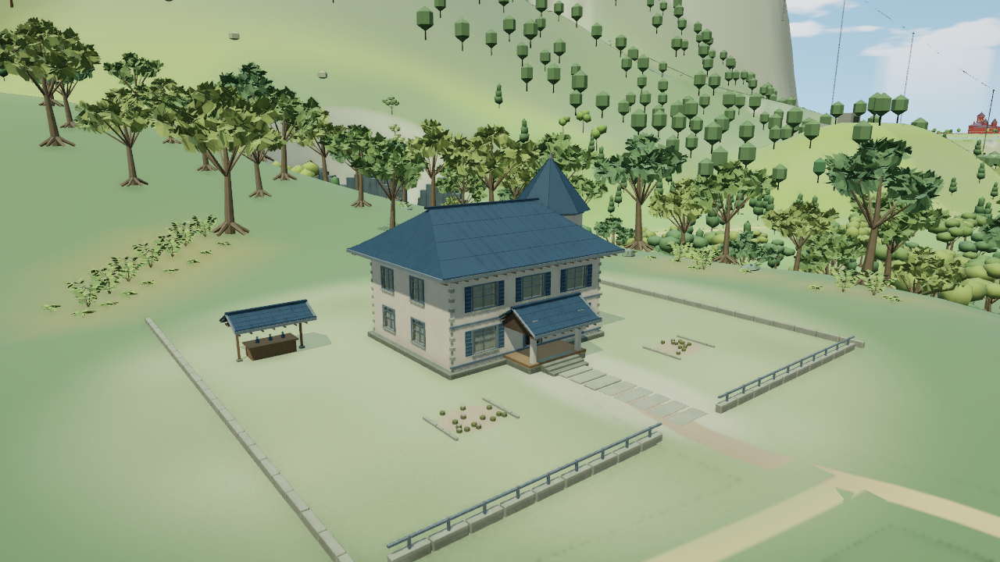

# 爱丽丝林下层 V2：拒收检查点

基于 `94865cb1dbf2348bfe5d51e2dfc37f22961352b3` 的隔离候选。V1、V2 均未获美术接受，不合入 main；两次尝试到此停止，不做 V3。CLI 退出 0 只表示有限技术检查通过。

V1 的植物过小、彼此分散，未接续左坡与原树脚。V2 放大并重排原28处植物后，右侧林缘有所改善，建筑和庭院净空保持；左侧仍是稀疏斜列，缺少自然中低层与坡面树脚连接，整景拒收。下面两张均为真实 WebGL 同机位，保留原样：

| 原版 | 拒收 V2 |
|---|---|
|  |  |

候选只新增28处公共林下植物（12灌木、16蕨），按四条真实近／远地形来源分四批，近4880、远904三角，共624672字节几何；复制局部地形 RGB。原生／冷代理树、建筑、路径、水面和详情构建器不改，无新贴图、灯或离屏目标。

已保存的 V2 有限 CPU 检查通过：足底最大误差7.34微米，原地形球界最小余量38.52米，实际顶点到维护庭院最小间隙7.44米。V1 的接入检查（0.502秒）通过生产 push 原句、晚失败回滚与重试、幂等、原数组保护，以及完整渲染链16次近远来源选择。V2 的接入层／几何 helper 未改，沿用该证据，并单独保存 V2 接地／净空报告；未重跑 V2 接入检查。

| 同一机位成本 | 原版 | V2 |
|---|---:|---:|
| 总绘制调用 | 356 | 358 |
| 提交三角 | 823532 | 828412 |
| 驻留属性估算 MiB | 23.768997 | 24.271622 |

这是该帧提交量和驻留属性统计，不是 FPS。未运行长回归、完整源扫描、低档／夜景／其他机位或卸载重入压力检查。CPU 与取图 CLI0 不代表这些未执行项通过。

## 复现候选

保留本分支的四个输入：`project.json`、`src/alice-understorey-ground.js`、`src/alice-understorey.js`、`src/alice-understorey-renderer.js`。`summary.json` 绑定每项源码、成品和两张原图的 SHA；既有源包不改。按仓库构建说明运行 `python tools/build.py`，从顶部选择爱丽丝原生机位：eye `[-1180,107,-207]`、target `[-1138,91,-260]`、FOV49，1280×720、DPR1、balanced、晴天12.5、AO开，动态／人物／标签／微光／反射关。此处说明复现步骤，本次整理未执行构建或再次取图。

冻结 V2 HTML SHA：`b7633a126b103b67ead36f155d4d8a0db1df5680a304f15096ea30c0f2ef46c3`（196项输入）。原版 HTML SHA：`092c07365756ad61676ced9c1eaad096a12503abc86645980aa8afe6ab4ee06f`。精简数字、技术／美术状态及历史证据路径见 [summary.json](summary.json)；完整 V1 源快照、CPU 脚本和运行报告留在 scratch，不上传历史 HTML 或大清单。
