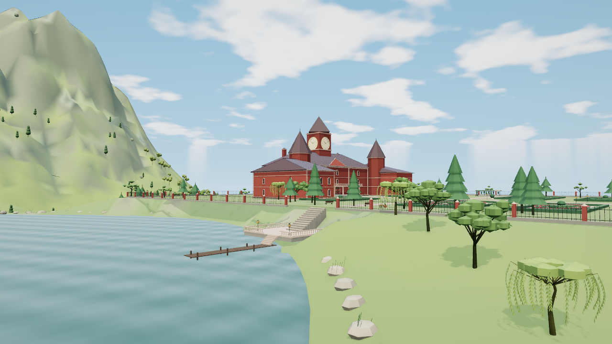
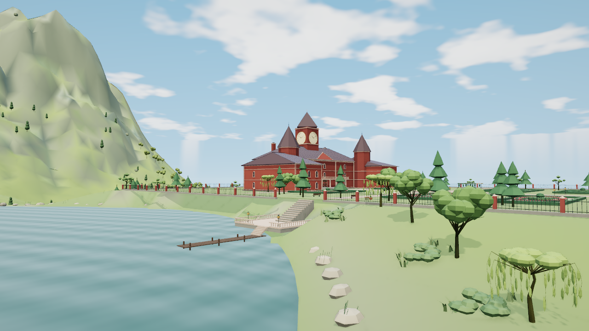

# 雾之湖东岸 V2：未验收的隔离检查点

此分支只保存可恢复候选，**不得据此合并 main**。基线是已验收的 `94865cb`；两次同机位全景之后停止本方法，不做第三稿或长回归。

范围为原东岸14棵树（6杉、5阔叶、3柳）、21处低中层植被及局部地面颜色。原点位、矩阵、RGB、全部木枝、声明包围范围、建筑、庭院、道路、岸石、芦苇、码头、湖形和水位保留。近远植被分别跟随实际地形源；不增加纹理、灯或渲染目标。

第一稿因散排小球岸丛、梨形针叶树及厚羽片柳叶拒收。第二稿改善了冠层体积、树种层次和三组植被分布，但低灌丛仍像绿色石盘，岸石到树脚的过渡仍显生硬。因此技术检查通过不等于美术通过。

原版：

第二稿，仍未验收：

## 可复现步骤

使用Node22.x，执行 `python3 tools/build.py`。197项输入应生成HTML SHA-256 `8f7111cb61c6cd75857d773eb0bbb637790d9eba8f8072d9b5196380b0638715`。成品不入Git。

运行 `python3 -m http.server --directory dist 8000`，打开本地成品并选 `scarletLake`。对照为1280×720、DPR1、balanced、晴天12.5、neutral、AO开，动态/标签/人物/微光/反射关。原生eye `[637,117.2,-552]`，target `[791,125,-705]`，FOV49。

`node experiments/lake-shore-v2/check-supplied.mjs` 可复现有限源检查：从现有资产解包，不建World或地区，不启动GPU；核对14/94树身份、全部原木、原sphere、共享原型传输隔离、原子提交和近远wanted。输出写入新的系统临时目录。它不验证整栋建筑接触，也不能代替看图。

本次有限CPU及浏览器实际退出0。唯一候选全景无脚本/GL/上下文错误，保留一条未归因404，浏览器与服务器已关闭。未执行low、清缓存重入、长回归或其它候选机位。静态总调用167→171、提交三角549235→535057，驻留属性21709840→22537984字节；纹理11保持。没有实体设备FPS结论。

精确输入、有限CPU、原始进程退出与拒收理由见同目录JSON。工作区绝对路径只记录原始证据出处。主线继续使用已验收成果，下一独立任务是爱丽丝宅林下和来路过渡。
