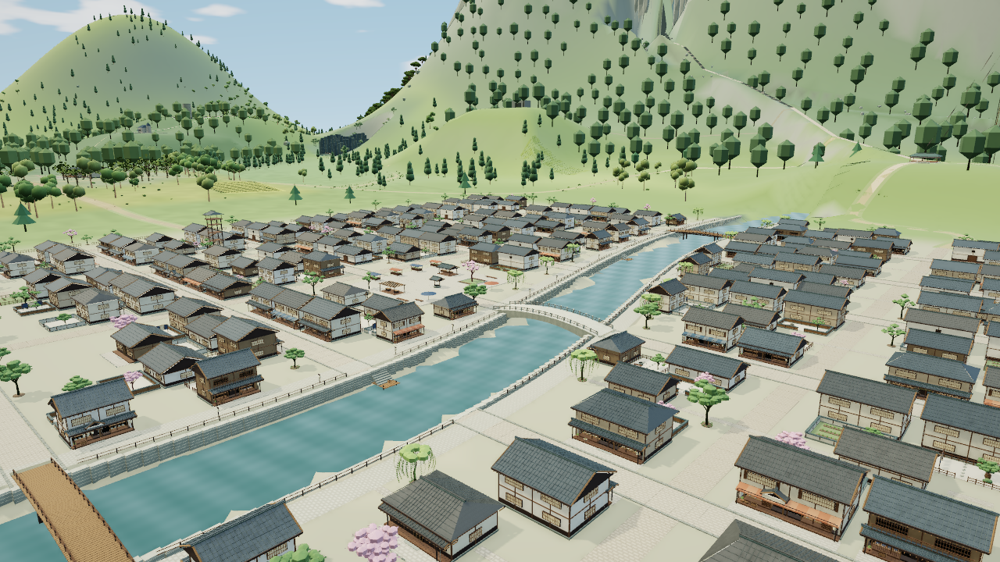

人里街巷／院落样板 V2：停止并保留证据。Root 实际查看同机位原版与 V2 后，第二次整景仍拒收；两次尝试上限已到，不做 V3、不再改源码、不跑 full／GPU、不推 main。Root 将保存隔离分支。主线 `94865cb` 的 755 森林冠层交付是另一项独立成果。

V2 比 V1 恢复了实体冠簇，但相对原版仍不足以通过街院整景门槛。23 处新增低中植被在本镜头实际选中的 far 档仍是微小散点，河岸、树脚和院落之间没有可读的群落层次。有限 CPU 正确性和技术截图入口通过；美术状态为拒收。后续应重新按屏幕可见体量、实际 LOD 和院落分组设计，先形成清楚的低／中层关系；停止围绕这套小点布局继续修原型细节。

冻结基础为 `ec9fdada167f955f1f2b16a6bb8a230e9577b786`，工作树 `/workspace/village-landscape`，分支 `experiment/village-landscape-20261004`。39 原树、193 原灌木、23 新候选点、房屋、街路、桥头、地形几何、hook 和材质保持本轮记录；V2 只改私有植物原型。完整 187 项构建输入及散列、源码快照、运行 HTML、release 和证据路径均在本目录 `manifest.json`。

- 植物源码：`src/village-landscape-plants.js`，SHA `422bc58156eb9b318073310a200d20f816c9c480c24604d75a33ab2c414dff5f`；冻结快照 `/workspace/scratch/village-landscape-v2/frozen-village-landscape-plants.js`。
- 集成源码：`src/village-landscape.js`，SHA `05f0e80203f70652e3e64130f17a0cbd326c3e06c1d6f4643bf7a01306f95ef7`，V2 未改；同目录有冻结快照。
- 运行入口：`/workspace/scratch/village-landscape-runtime-v2/manifest.json`；HTML SHA `aaf3307e394708ad4f699cb4a096c3a37b45d2905e8f89ae94d1875c118023fa`。
- 有限 CPU：`/workspace/scratch/village-landscape-v2/cpu-report.json` 与 `closed-crown-support.json`，Node22；原矩阵／RGB／干前缀、预算、有效面、原记录包围球通过。目标加新植被展开为近档192306、远档30570三角。未进行 full 回归。
- 同机位原版：`/workspace/scratch/texture-experiment/village-landscape-v1.1-visual/riverside-original.png`；V1：同目录 `riverside-candidate.png`；V2：`/workspace/scratch/texture-experiment/village-landscape-v2-visual/riverside-candidate.png`。V2 的 `report.json` 记录实际CLI0；本检查点记录 Root 的最终美术拒收决定。

验收机位为 eye `[148,88,182]`、target `[-6,32,10]`、FOV49、1280×720、DPR1、balanced、晴天12.5、AO开、运动／bloom／reflection关。新公共 shrub／herb 在这张整景实际为远档；不能用近档叶片改动代替此档位的体量判断。旧8fd图只作为初始问题观察，同版对照使用上列新拍 ec9 原图。

复现入口供后续恢复审阅使用；本轮停止且不默认重跑 GPU，收尾未执行以下命令。历史目录均保留，复现须输出到新的 scratch，不能覆盖冻结证据。CPU 脚本的 `out` 和闭合冠簇报告路径也须先改成新目录。

```bash
cd /workspace/village-landscape
# 轻量打包，不构造区域或世界；输出目录须为新审计目录。
python tools/build.py --output-dir /workspace/scratch/village-landscape-replay-runtime
# 既有有限CPU入口；复制后改输出路径再执行，保持旧证据。
/home/agent/.npm/_npx/52027bd8fc0022aa/node_modules/node/bin/node /workspace/scratch/village-landscape-v2/check-draft.mjs
/home/agent/.npm/_npx/52027bd8fc0022aa/node_modules/node/bin/node /workspace/scratch/village-landscape-v2/check-crown-support.mjs
# 既有第二次唯一机位runner；本轮不默认重跑 GPU，后续恢复审阅须使用全新输出目录。
python /workspace/scratch/village-landscape-v2.1-gate.py --output /workspace/scratch/village-landscape-replay-visual
```

Runner 内绑定了冻结 runtime、187 输入、HTML／release 和复用原图的 SHA。源码未来若变动，应保存新审计版本与证据，不改写本检查点，也不把当前候选标成已通过。冻结的 V2 `status.json` 原记录“待视觉”；本检查点 `manifest.json.rootDecision` 是在第二次实图之后的最终状态。

本隔离分支保留精确候选源码及上述紧凑证据，不是可合并版本，也不改变主线。以下两图可直接审阅：

原版：



第二次拒收候选：


从本分支干净导出后运行 `python3 tools/build.py` 可以重建冻结的187项输入和同一HTML；`dist`成品不提交。使用普通本地HTTP服务器打开成品的 `#view=riverside&lighting=neutral`，按上列相机/设置即可人工复查。工作区绝对路径是原始实验出处；原始大报告和失败试稿继续保存在scratch，不将记录的有限CPU或取图技术通过写成完整回归、美术验收或FPS收益。
